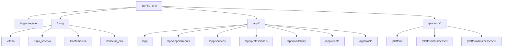

# 3. Arquitectura de información — Turnify

## Principio de organización

Una SPA, tres superficies. La navegación refleja actores, no módulos técnicos.

## Mapa del sitio

## Jerarquía de valor

1. **Reserva pública** — captura demanda.
2. **Agenda gerente** — operación diaria.
3. **Catálogo + disponibilidad** — habilitan 1 y 2.
4. **Clientes / perfil** — soporte.
5. **Plataforma** — control SaaS (uso infrecuente).

## Navegación por superficie

### Pública
Wizard lineal: negocio → servicio → profesional → fecha/slot → datos → confirmación. Sin menú lateral. Link a cancelar.

### Gerente (`AppShell`)
Nav lateral/superior: Dashboard, Agenda, Servicios, Profesionales, Disponibilidad, Clientes, Perfil. CTA primario: “Nueva cita”.

### Plataforma (`PlatformShell`)
Nav: Dashboard, Negocios.

### Auth
Login y registro fuera de shells. Post-login redirect por `scope`.

## Rutas reservadas vs slug

Rutas fijas tienen prioridad sobre `/:slug`: `login`, `register`, `app`, `platform`, `cancel`.

## Decisión UX vs arquitectura

| Tipo | Decisión |
|------|----------|
| Necesidad | Encontrar rápido agenda / reservar en pocos pasos |
| UX | Wizard público; shell con pocas entradas en gerente |
| Arquitectura | Prefijos `/app` y `/platform` evitan colisión con slugs |
| Técnica | React Router (punto 9) |
