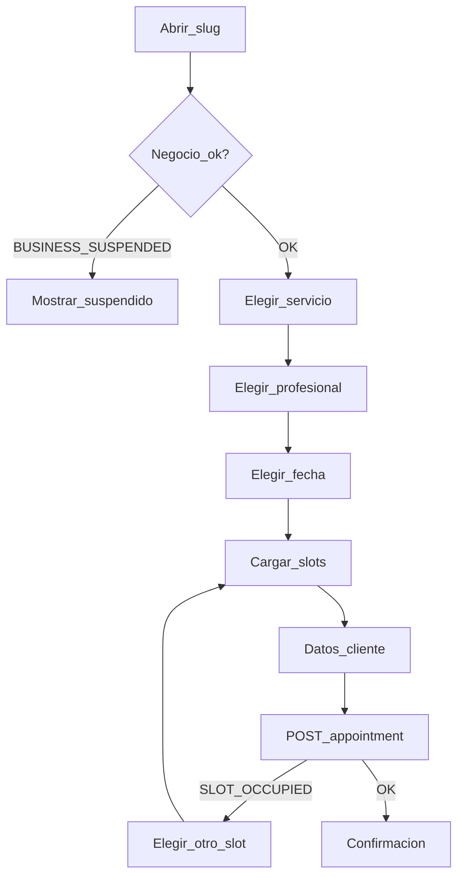

# 4. Modelado funcional — Turnify

## Estados de cita

`confirmed` → `cancelled` | `completed` | `no_show`

Transiciones inválidas → `INVALID_STATE_TRANSITION` (409).

## User Journeys

### J1 — Cliente reserva

1. Abre `/{slug}`.
2. Elige servicio → profesional → fecha → slot.
3. Ingresa nombre, teléfono, email opcional.
4. Confirma; guarda `appointment.id` localmente.
5. Ve confirmación.

### J2 — Cliente cancela

1. Abre cancelación con `appointmentId`.
2. Confirma con `phone`.
3. Éxito o error (`CANCELLATION_TOO_LATE`, etc.).

### J3 — Gerente configura y opera

1. Se registra (negocio + slug).
2. Crea servicios y profesionales; asocia ofertas.
3. Define horario semanal y excepciones.
4. Comparte slug público.
5. Opera agenda: crear asistida, cancelar, reprogramar, completar, no-show.

### J4 — Admin plataforma

1. Login `scope=platform`.
2. Ve métricas; crea/suspende negocios; vincula gerente.

## Historias de usuario (P0/P1)

- Como cliente, quiero reservar un turno en minutos sin cuenta.
- Como cliente, quiero cancelar con mi teléfono.
- Como gerente, quiero registrar mi negocio y obtener un slug.
- Como gerente, quiero definir servicios, profesionales y horarios.
- Como gerente, quiero ver y gestionar citas del período.
- Como gerente, quiero crear una cita asistida (incluso `forced`).
- Como admin, quiero suspender un negocio abusivo.

## Casos de uso clave

| ID | Actor | Caso |
|----|-------|------|
| UC01 | Cliente | Consultar vitrina |
| UC02 | Cliente | Reservar slot |
| UC03 | Cliente | Cancelar cita |
| UC04 | Gerente | Auth registro/login |
| UC05 | Gerente | CRUD catálogo |
| UC06 | Gerente | Disponibilidad |
| UC07 | Gerente | Agenda y mutaciones |
| UC08 | Gerente | Clientes y perfil |
| UC09 | Admin | Tenants |

## Flujos

## Mapa error.code → UX

| Código | HTTP | UX |
|--------|------|-----|
| VALIDATION_ERROR | 400 | Mensajes por campo |
| UNAUTHENTICATED / INVALID_CREDENTIALS | 401 | Re-login / credenciales |
| FORBIDDEN / BUSINESS_SUSPENDED | 403 | Bloqueo claro |
| NOT_FOUND | 404 | Vacío / enlace inválido |
| SLOT_OCCUPIED / CONFLICT / SLUG_ALREADY_EXISTS | 409 | Conflicto accionable |
| PROFESSIONAL_INACTIVE / INVALID_STATE_TRANSITION | 409 | Explicar y ofrecer alternativa |
| OUTSIDE_AVAILABILITY / CANCELLATION_TOO_LATE | 422 | Explicar regla de negocio |
| CLIENT_APPOINTMENT_LIMIT | 429 | Límite alcanzado |
| INTERNAL_ERROR | 500 | Reintentar más tarde |

## Excepciones de diseño

- Sin slots: empty state “No hay horarios; prueba otra fecha”.
- Negocio sin servicios activos: empty state en vitrina.
- Agenda vacía: CTA “Nueva cita” / “Comparte tu enlace”.
