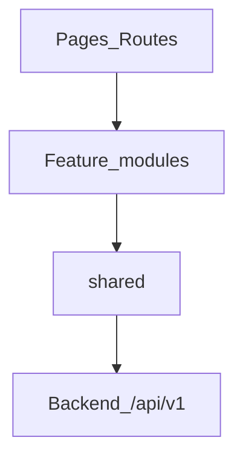

# 5. Arquitectura del Frontend (conceptual)

## Módulos / features

| Feature | Responsabilidad | Superficie |
|---------|-----------------|------------|
| `auth` | Login, registro, sesión, redirect por scope | Auth |
| `public-booking` | Vitrina, wizard reserva, confirmación, cancel | Pública |
| `business-dashboard` | Métricas gerente | Gerente |
| `catalog` | Servicios, profesionales, ofertas | Gerente |
| `availability` | Weekly schedule + exceptions | Gerente |
| `appointments` | Agenda, mutaciones, cita asistida | Gerente |
| `clients` | Búsqueda y edición | Gerente |
| `business-profile` | Perfil / slug / políticas | Gerente |
| `platform` | Dashboard y tenants | Plataforma |

## Shared

| Módulo | Responsabilidad |
|--------|-----------------|
| `api-client` | baseURL, Bearer, parseo envelope error |
| `auth-session` | token, scope, business_id |
| `errors` | code → mensaje ES |
| `datetime` | UTC ↔ timezone negocio |
| `ui` | primitivos reutilizables |

## Separación de responsabilidades

- Features no importan otras features (solo `shared`).
- Pantallas orquestan; componentes de negocio presentan.
- Toda I/O HTTP pasa por `api-client` + funciones por dominio.

## Comunicación

- Público ↔ Gerente: **ninguna** (solo comparten tipos/helpers).
- Auth → session store → route guards.
- Mutaciones de agenda invalidan listas locales/caché de appointments.

## Alternativa descartada

Microfrontends o monorepo de 3 apps: mayor costo de build/deploy sin beneficio en MVP.
