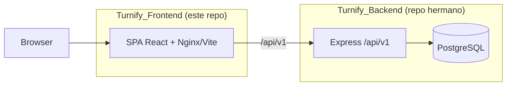
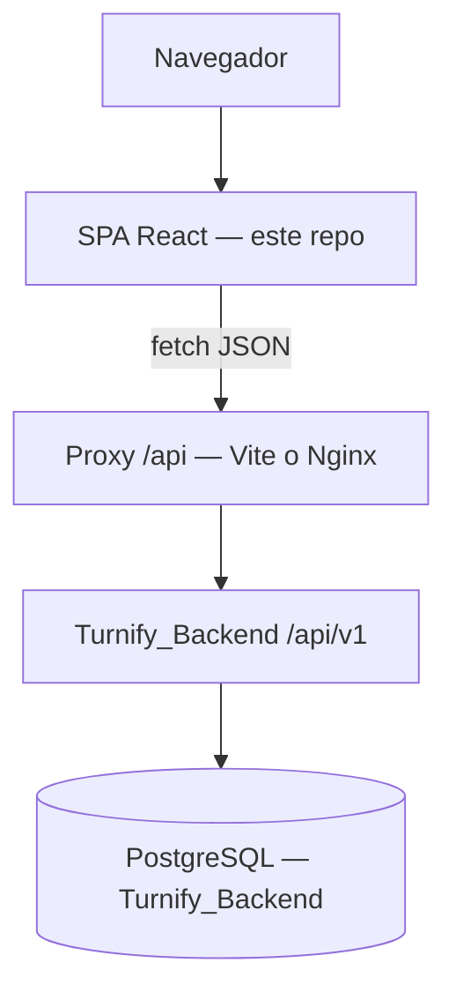
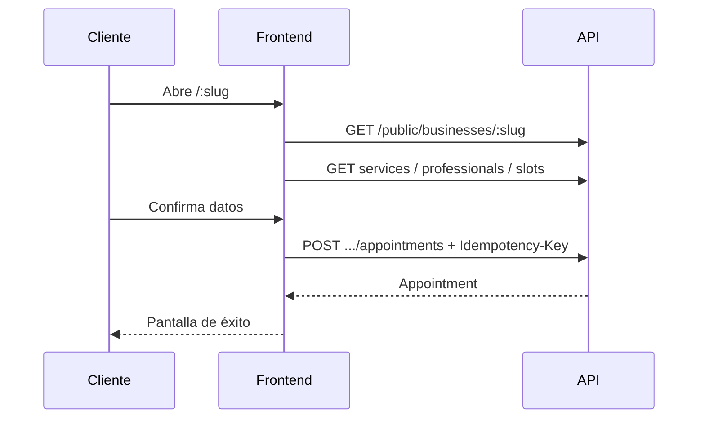
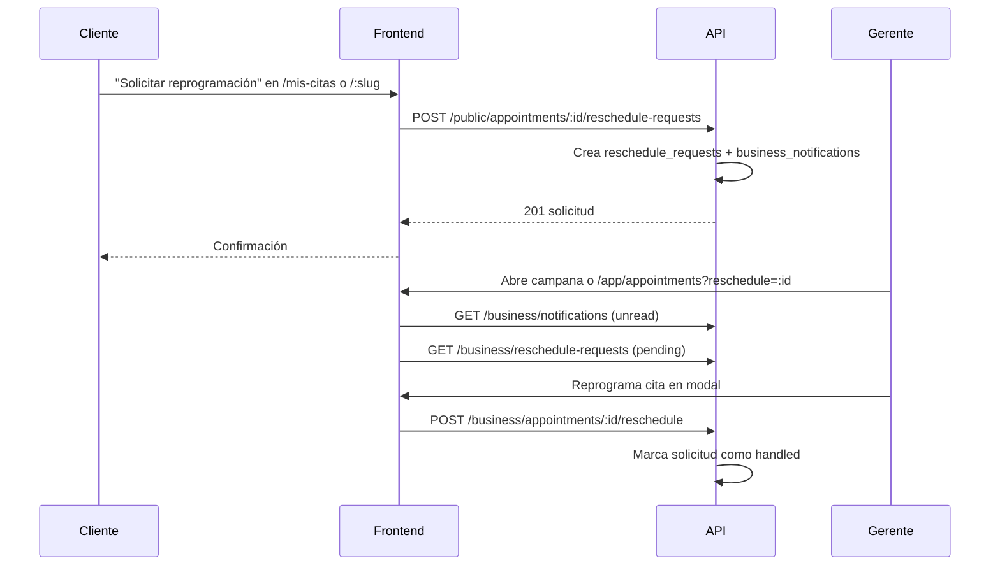
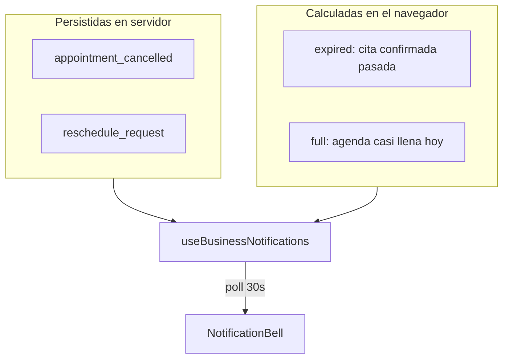
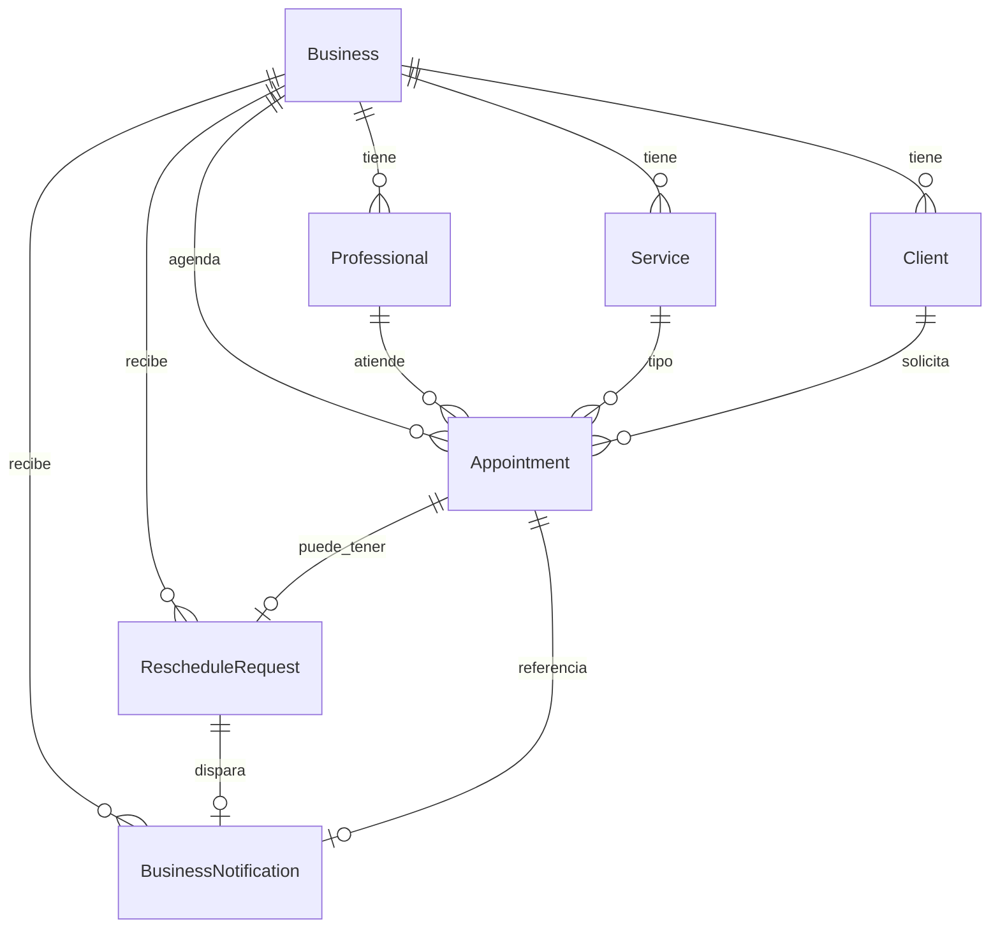
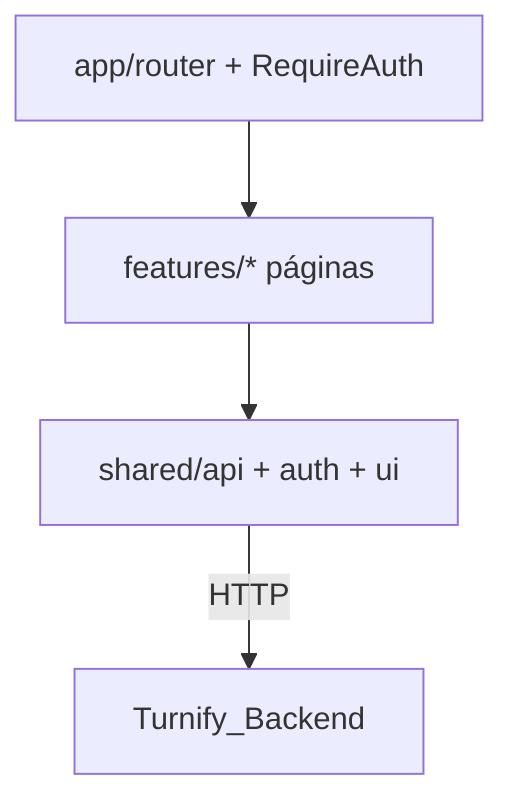

# Sustentación Turnify Frontend

**Metodología de este documento:** elaborado a partir del **código ejecutable** y la **configuración** de este repositorio (`frontend/src`, `package.json`, Docker, Vite, env examples), complementado con el contrato HTTP que el front consume (implementado en el repo hermano **Turnify_Backend**, fuera de este repo).

**Qué es este repo en la práctica:** la capa de **presentación** (SPA React). **No incluye** el servidor de negocio ni la base de datos, pero el producto completo se demuestra con el backend levantado en paralelo.

**Última revisión al código:** julio 2026.

---

## 1. Resumen ejecutivo

### Qué es

Turnify Frontend es la interfaz web de un sistema de **citas para negocios de servicios**. En el navegador permite:

1. Que un **cliente** reserve, cancele, consulte citas y **solicite reprogramación** en la página pública (`/nombre-del-negocio`, `/mis-citas`) sin registrarse.
2. Que un **gerente** administre catálogo, horarios, agenda, clientes y reciba **notificaciones** (`/app`).
3. Que un **administrador de plataforma** gestione varios negocios (`/platform`).

Todo lo visible es React en el cliente; los datos y las reglas los responde una **API REST** en `/api/v1/...` (proyecto **Turnify_Backend**).

### Qué problema ataca

El software concentra en un solo producto web:

- reserva online guiada (servicio → profesional → horario → datos),
- operación diaria de citas (crear, cancelar, reprogramar, completar, no-show),
- **solicitudes de reprogramación del cliente** persistidas en servidor (multi-dispositivo),
- **notificaciones al negocio** (cancelaciones, reprogramaciones, más alertas derivadas en cliente),
- configuración de oferta y disponibilidad,
- administración multi-negocio con roles distintos (`business` vs `platform`).

### Propuesta de valor (observable)

| Para quién | Valor que la app entrega |
|------------|---------------------------|
| Cliente | Reservar, cancelar, consultar citas y pedir reprogramación con enlace y teléfono |
| Gerente | Panel único: agenda, servicios, equipo, horarios, clientes, perfil, campana de avisos |
| Plataforma | Alta de negocios, suspensión, gerentes, health y logs |

### Relación frontend ↔ backend

| Aspecto | Frontend (este repo) | Backend (Turnify_Backend) |
|---------|----------------------|---------------------------|
| Ubicación | `Turnify_Frontend` | Repo hermano local o remoto |
| Puerto típico dev | Vite `:5173` o Docker `:8080` | `:3000` |
| Responsabilidad | UI, rutas, sesión, fetch | Reglas de negocio, JWT, PostgreSQL |
| OpenAPI | No vive aquí | `http://localhost:3000/api-docs` |



### Límites honestos (porque el código lo muestra)

- Este repositorio **no es el sistema completo**: sin API no hay datos reales.
- La sesión de gerente/plataforma se guarda en `localStorage` (no cookies HttpOnly).
- **`/mis-citas` global** agrega citas de negocios “recordados” en el dispositivo (`clientAppointmentsStorage`); no hay lookup cross-tenant en el MVP.
- Las notificaciones son **híbridas**: algunas vienen del servidor; otras se calculan en el cliente (citas vencidas, agenda casi llena).
- Hay **3 archivos** de tests Vitest; no hay E2E ni tests de componentes.
- Queda código **legacy** (`rescheduleRequestStorage.ts`) sin uso en el flujo principal; el tipo se reutiliza en el builder de notificaciones.

---

## 2. Documentación técnica (basada en código)

### 2.1 Arquitectura del sistema



**Hecho verificable:** `docker-compose.yml` de este repo solo define el servicio `frontend`. Postgres y la API viven en el compose del backend.

### 2.2 Tres superficies (router real)

Fuente: `frontend/src/app/router.tsx`.

| Prefijo | Guard | Páginas (lazy) |
|---------|-------|----------------|
| Público | ninguno | `/:slug`, `/:slug/mis-citas`, `/mis-citas`, `/cancel/:appointmentId` |
| Negocio | `RequireAuth scope="business"` | `/app` → dashboard, appointments, services, professionals, availability, clients, profile |
| Plataforma | `RequireAuth scope="platform"` | `/platform` → dashboard, businesses, detail, log-viewer, health, account |
| Auth | ninguno | `/`, `/login`, `/register`, `/forgot-password`, `/reset-password` |

**Nota sobre `/mis-citas`:** ruta global sin slug; el cliente elige teléfono y el front consulta cada negocio recordado en el navegador.

### 2.3 Tecnologías (package.json)

| Tecnología | Evidencia | Lectura razonable |
|------------|-----------|-------------------|
| React 19 + react-dom | dependencies | UI por componentes |
| React Router 7 | dependencies + `router.tsx` | Rutas anidadas y guards |
| Vite 8 | devDependency + scripts | Dev server + build |
| TypeScript ~6 | tsconfig + `tsc -b` en build | Tipado estático |
| Tailwind 4 + plugin Vite | dependencies | Utilidades CSS |
| sonner | `App.tsx` Toaster | Feedback toast |
| clsx + CVA | Button/ui | Variantes de componentes |
| Vitest, oxlint | scripts | Calidad mínima |
| fetch nativo | `shared/api/client.ts` | HTTP sin Axios |

**No aparecen** en dependencies: Redux, React Query, Axios, Next.js, MUI/Chakra.

### 2.4 Estructura de carpetas (real)

```
frontend/src/
  app/                 # router, RequireAuth
  features/
    auth/              # login, registro, passwords, HomePage, api.ts
    app/               # AppShell
    public-booking/    # wizard, cancel, mis-citas, modal reprogramación
    dashboard/
    appointments/      # agenda + deep-links ?reschedule= / ?focus=
    catalog/           # services, professionals
    availability/
    clients/
    business-profile/
    platform/          # shell + páginas admin + api.ts
    notifications/     # campana, hook, builder derivado
  shared/
    api/               # client, business, public, types, errores
    auth/              # session + AuthContext
    config/env.ts
    datetime/
    ui/                # atoms → templates, glass, ShellLayouts
    hooks/, lib/, storage/
  App.tsx, main.tsx, index.css
```

Patrón observable: **organización por feature de UI** + **shared** transversal. Las páginas son lazy + `Suspense`.

### 2.5 Autenticación y sesión

Archivos: `shared/auth/session.ts`, `AuthContext.tsx`, `RequireAuth.tsx`, `shared/api/client.ts`.

1. Login/register llaman API y reciben `access_token` + `scope` (+ `business_id` opcional).
2. Se persiste en `localStorage` clave `turnify.session`.
3. Requests con `auth: true` envían `Authorization: Bearer …`.
4. `RequireAuth` bloquea sin sesión y redirige si el `scope` no coincide.
5. Ante HTTP 401 (o código `ACCESS_DISABLED` en request autenticado) se limpia la sesión.

**No implementado en el cliente:** refresh token; bootstrap con `GET /auth/me` (la función existe en `features/auth/api.ts` pero no se usa al arrancar).

### 2.6 Capa API y endpoints presentes en el código

Cliente único: `apiRequest` → `${API_V1}${path}`.

Prefijos usados:

- `/auth/*` — `features/auth/api.ts`
- `/business/*` — `shared/api/business.ts`
- `/public/*` — `shared/api/public.ts`
- `/platform/*` — `features/platform/api.ts`

#### Auth (ejemplos)

- `POST /auth/login`, `POST /auth/register`, `POST /auth/forgot-password`, `POST /auth/reset-password`, `POST /auth/change-password`

#### Business (ejemplos)

- `GET/PATCH /business/profile`, `GET /business/dashboard`
- CRUD services/professionals, weekly-schedule, availability-exceptions
- Appointments: list/create + cancel/reschedule/complete/no-show
- Clients: list/PATCH + block/unblock
- **Notificaciones (nuevo):**
  - `GET /business/notifications?status=unread&limit=50`
  - `PATCH /business/notifications/:id` `{ status }`
  - `POST /business/notifications/mark-all-read`
- **Solicitudes de reprogramación (nuevo):**
  - `GET /business/reschedule-requests?status=pending`
  - `PATCH /business/reschedule-requests/:id` `{ status }`

#### Public (ejemplos)

- `GET /public/businesses/:slug`, services, professionals, slots
- `POST .../appointments` (+ header `Idempotency-Key`)
- `POST /public/appointments/:id/cancel` `{ phone }`
- **`POST /public/appointments/:id/reschedule-requests` `{ phone, message }`** (nuevo)
- `POST /public/businesses/:slug/appointments/lookup` `{ phone }`

Errores esperados: JSON `{ error: { code, message, details? } }` → clase `ApiError` + mapa de mensajes en `errorMessages.ts`.

### 2.7 Flujo: reserva pública



### 2.8 Flujo: solicitud de reprogramación (servidor)

**Estado actual:** el cliente **no** elige nuevo horario; envía un mensaje. El gerente reprograma desde el panel.



Archivos clave:

- Cliente: `PublicRescheduleRequestModal.tsx` → `createPublicRescheduleRequest`
- Gerente: `AppointmentsPage.tsx` (deep-link `?reschedule=`, hint del mensaje)
- API cliente: `shared/api/public.ts`, `shared/api/business.ts`

### 2.9 Flujo: notificaciones al negocio (híbrido)



| Origen | Tipos | Cómo llegan |
|--------|-------|-------------|
| Servidor | Cancelación pública, solicitud reprogramación | `GET /business/notifications` |
| Cliente | Cita vencida sin cerrar, profesional casi lleno | `buildBusinessNotifications` sobre citas + horarios |

Hook: `useBusinessNotifications.ts` — poll cada 30 s, refresh al volver a la pestaña, rango de citas −7 / +45 días.

Deep-links en `href`:

- Cancelación / foco: `/app/appointments?focus=<appointmentId>`
- Reprogramación: `/app/appointments?reschedule=<appointmentId>`

### 2.10 Modelo de datos (vista del frontend)

**Hecho:** no hay SQL ni ORM en este repo.

**Modelo que consume el cliente** (tipos en `shared/api/types.ts` + DTOs nuevos en `business.ts`):



Tablas físicas en backend (migración `20260727000001-reschedule-requests-and-notifications.js`):

- `reschedule_requests` — `status`: pending | seen | handled | dismissed
- `business_notifications` — `type`: p. ej. `appointment_cancelled`, `reschedule_request`; `status`: unread | read | dismissed

### 2.11 Dependencias y entorno local

| Variable / mecanismo | Comportamiento |
|----------------------|----------------|
| `VITE_API_BASE_URL` undefined | Base `http://localhost:3000` → `/api/v1` |
| `VITE_API_BASE_URL` vacío | Same-origin `/api/v1` (prod Docker) |
| `VITE_PROXY_TARGET` | Proxy Vite `/api` → backend (default `http://localhost:3000`; en Docker `host.docker.internal:3000`) |
| Nginx prod | Proxy `/api/` → `BACKEND_UPSTREAM` |
| `.env` raíz | Docker compose (puerto 8080, upstream backend) |
| `frontend/.env` | Dev Vite (proxy target) |

#### Levantar el stack completo (estudio / demo)

```bash
# Terminal 1 — Backend (repo Turnify_Backend)
docker compose up --build
# → http://localhost:3000  (health, /api-docs)

# Terminal 2 — Frontend prod local (este repo)
cp .env.docker.example .env   # BACKEND_SCHEME=http, BACKEND_UPSTREAM=host.docker.internal:3000
docker compose up --build
# → http://localhost:8080

# Alternativa dev con hot reload
cd frontend && cp .env.example .env
# VITE_PROXY_TARGET=http://localhost:3000
npm install && npm run dev
# → http://localhost:5173
```

### 2.12 UI system y capa visual “glass”

`shared/ui/index.ts` exporta design system (atoms → templates): Button, Input, Modal, ShellFrame, etc.

**Mejora reciente observable:**

- Wallpaper de fondo `fondo_sistem-agenden.webp` en el shell de negocio (`ShellLayouts.tsx`, `index.css`).
- Superficies **glass** centralizadas en `shared/ui/lib/glass.ts` (`glassPanelClass`, `glassHeaderClass`, `glassNavClass`, `glassFooterClass`, `glassPopoverClass`).
- Footer con variante `surface="glass"` en `SiteFooter.tsx`.
- Modales y campana de notificaciones usan blur + borde semitransparente.

Estilos globales: `index.css` (Tailwind `@theme`, Manrope, tokens brand, reglas `.glass-*` con fallback sin blur).

### 2.13 Tests existentes

1. `shared/api/errorMessages.test.ts`
2. `shared/datetime/index.test.ts`
3. `features/notifications/buildBusinessNotifications.test.ts`

No hay tests E2E ni de componentes React.

### 2.14 Deuda / bugs conocidos (auditoría reciente, sin fix completo)

Útiles para sustentación honesta:

| Tema | Síntoma | Dónde mirar |
|------|---------|-------------|
| Login pierde query params | Deep-link a `/login?next=...` no siempre se respeta | `LoginPage.tsx`, guards |
| Timezone inconsistente | Mezcla UTC local vs zona del negocio en algunos formatos | `shared/datetime/` |
| `body.overflow` | Drawer + modal pueden dejar scroll bloqueado | modales / drawer |
| Marketing shell | `overflow-hidden` puede recortar contenido largo | layouts marketing |
| Legacy storage | `rescheduleRequestStorage.ts` ya no alimenta el flujo principal | storage/ |

---

## 3. Documentación pedagógica

### 3.1 Orden de lectura recomendado (para estudiar)

1. **Entrada y rutas:** `main.tsx` → `App.tsx` → `app/router.tsx` → `RequireAuth.tsx`
2. **HTTP y errores:** `shared/api/client.ts` → `types.ts` → `business.ts` / `public.ts`
3. **Sesión:** `shared/auth/session.ts` → `AuthContext.tsx`
4. **Flujo cliente:** `PublicBookingPage.tsx` → `MyAppointmentsPage.tsx` → `PublicRescheduleRequestModal.tsx`
5. **Flujo gerente:** `AppShell.tsx` → `AppointmentsPage.tsx` → `RescheduleModal.tsx`
6. **Notificaciones:** `useBusinessNotifications.ts` → `buildBusinessNotifications.ts` → `NotificationBell.tsx`
7. **UI shell:** `ShellLayouts.tsx` → `glass.ts` → `index.css`
8. **Contrato API:** `docs/frontend-api-contract.md` + OpenAPI del backend

### 3.2 Analogías

| Concepto en el código | Analogía |
|-----------------------|----------|
| SPA | Edificio: cambias de piso (ruta) sin salir a la calle |
| `features/` | Departamentos (caja, almacén, dirección) |
| `shared/` | Servicios centrales (seguridad, mensajería) |
| JWT en localStorage | Credencial en el bolsillo del navegador |
| `scope=business` vs `platform` | Empleado de una tienda vs gerente del centro comercial |
| Proxy `/api` | Recepcionista que reenvía al almacén (API) |
| Idempotency-Key | Número de ticket: reenviar no duplica el pedido |
| Notificación servidor vs derivada | Aviso en buzón oficial vs recordatorio que tú calculas en la pizarra |
| Reprogramación pública | Nota al mostrador: el cliente pide otro día; el staff confirma |

### 3.3 Glosario breve

| Término | Significado |
|---------|-------------|
| Frontend | Código que corre en el navegador |
| Backend / API | Servidor con reglas y datos (Turnify_Backend) |
| SPA | App web de una sola carga inicial |
| Endpoint | URL + método HTTP |
| JWT / token | Cadena que prueba sesión y rol |
| Scope | Rol: `business` o `platform` |
| Slug | URL del negocio (`/mi-barberia`) |
| Lazy loading | Cargar pantallas solo cuando se necesitan |
| Deep-link | URL con query (`?reschedule=`) que abre un flujo concreto |
| DTO | Forma JSON que el front espera del API |

### 3.4 Guía “¿cómo funciona?” (paso a paso)

1. Arrancas frontend y backend.
2. El navegador carga la SPA React.
3. Cada pantalla pide datos con `fetch` a `/api/v1/...` (directo o vía proxy).
4. Si hay login, el token viaja en `Authorization`.
5. El backend responde JSON; la UI muestra o traduce el error.
6. Si el token es inválido (401), la app borra sesión y manda a `/login`.
7. Eventos de negocio (cancelación, reprogramación) generan filas en `business_notifications`; la campana las lista y enlaza a la agenda.

---

## 4. Diagramas adicionales

### Capas internas del frontend



### Decisión de acceso post-login

```mermaid
flowchart TD
  L[Login API] --> S{scope?}
  S -->|business| APP[/app]
  S -->|platform| PLAT[/platform]
  PUB[/:slug o /mis-citas] --> W[Reserva / consulta / reprogramación]
```

---

## 5. Justificación de decisiones

**Leyenda:** **Observado** = en código. **Inferido** = explicación plausible.

| Decisión | Tipo | Alternativas | Argumento |
|----------|------|--------------|-----------|
| SPA React + Vite | Observado | Next.js | Panel + vitrina sin SSR obligatorio |
| Guards por scope | Observado | Apps separadas | Una base UI; `/app` vs `/platform` |
| Feature folders | Observado | `pages/` plano | Cohesión por dominio de producto |
| `shared/api` + `apiRequest` | Observado | Axios suelto | Auth, errores y base URL en un sitio |
| Sin Redux/React Query | Observado | Estado global | Auth en Context; cada página refresca lo suyo |
| Notificaciones híbridas | Observado | Solo push / solo cliente | Servidor para eventos reales; cliente para heurísticas (vencidas, lleno) |
| Reprogramación vía API | Observado | Solo WhatsApp / localStorage | Multi-dispositivo, auditoría, campana unificada |
| Tailwind + UI propia + glass | Observado | Librería pesada | Control visual coherente |
| Sesión en localStorage | Observado | Cookie HttpOnly | Simple en SPA; trade-off XSS |
| Docker solo frontend | Observado | Monolito | Despliegue desacoplado del backend |
| Tests acotados | Observado | E2E full | Utilidades críticas; UI poco cubierta |

### Trade-offs para admitir en sustentación

1. **Token en localStorage** vs comodidad SPA (riesgo XSS).
2. **Notificaciones derivadas** no están en DB; desaparecen si cambia la heurística o no hay datos de horarios.
3. **Reprogramación pública** es solicitud, no autoservicio de slot (decisión de producto MVP).
4. **Staff reschedule** usa endpoints `/public/.../slots` para disponibilidad (acoplamiento public/business).
5. **Sin `/auth/me` al inicio:** se confía en storage hasta el primer 401.
6. **`/mis-citas` global** depende de negocios recordados en el dispositivo.
7. **Dependencia total del backend** para demo de punta a punta.

---

## 6. Preguntas y respuestas (≥ 24)

### Perfil técnico

**1. ¿Dónde está el backend?**  
En el repo **Turnify_Backend** (hermano de este proyecto). Este front solo proxifica `/api/v1` vía Vite o Nginx.

**2. ¿Cómo se separan gerente y admin?**  
Campo `scope` en sesión (`business` | `platform`) + `RequireAuth` + rutas `/app` vs `/platform`.

**3. ¿Qué ocurre en un 401?**  
`clearSession()` limpia `localStorage`, notifica `AuthContext` y el guard redirige a `/login`.

**4. ¿Por qué feature-based?**  
Agrupa pantallas y APIs por dominio; facilita localizar cambios (appointments, public-booking, platform…).

**5. ¿Usan Axios?**  
No. `fetch` en `shared/api/client.ts`.

**6. ¿Hay refresh token?**  
No en el cliente actual.

**7. ¿Cómo evitan CORS en desarrollo?**  
Proxy Vite de `/api` a `VITE_PROXY_TARGET`; en prod Docker, Nginx reenvía `/api/`.

**8. ¿La reprogramación pública pega al API?**  
**Sí.** `POST /public/appointments/:id/reschedule-requests` desde `PublicRescheduleRequestModal.tsx`. Ya no depende de `localStorage` para el flujo principal.

**9. ¿Qué tests hay?**  
Tres unitarios: mensajes de error, datetime, builder de notificaciones.

**10. ¿Dónde vive el design system?**  
`frontend/src/shared/ui` + tokens en `index.css` + utilidades `glass.ts`.

**11. ¿Cómo funcionan las notificaciones?**  
Mezcla: `GET /business/notifications` (servidor) + reglas en `buildBusinessNotifications` (cliente). Poll 30 s en `useBusinessNotifications`.

**12. ¿Qué pasa cuando el gerente abre una notificación de reprogramación?**  
El `href` lleva a `/app/appointments?reschedule=<appointmentId>`; la página carga la cita, muestra el mensaje del cliente y puede abrir el modal de reprogramación.

### Perfil académico / docente

**13. ¿Cuál es el objeto de estudio de este repo?**  
Capa de presentación multi-rol: organización por features, integración HTTP, UX de tres superficies y patrones SPA desacoplados del dominio.

**14. ¿Se puede hablar de Clean Architecture?**  
Parcialmente: separación UI / sesión / cliente HTTP. El dominio profundo está en el backend (use cases, repositorios).

**15. ¿Alta cohesión / bajo acoplamiento?**  
Cohesión por features: sí. Acoplamiento al contrato OpenAPI: inevitable y deseable en frontend. Entre features: bajo; excepción: agenda staff usa slots públicos.

**16. ¿Qué metodología se evidencia?**  
Entrega incremental de pantallas conectadas a endpoints; tipado TS; containerización; iteración reciente backend+front (notificaciones, reprogramación).

**17. ¿Limitaciones técnicas?**  
Dependencia de API externa; seguridad de storage; tests insuficientes para UI; notificaciones derivadas no persistidas; `/mis-citas` cross-tenant limitado al dispositivo.

**18. ¿Qué validaría un evaluador en demo?**  
Reserva pública → solicitud reprogramación desde otro navegador → campana en panel → reprogramar → cancelación pública genera notificación.

**19. ¿Aporte del trabajo?**  
SPA tipada, modular, desplegable sola, con roles, vitrina pública, reprogramación y notificaciones integradas vía contrato REST.

### Perfil usuario final / no técnico

**20. ¿Para qué sirve si tengo un negocio?**  
Tus clientes reservan por enlace; tú ves la agenda y recibes avisos en la campana.

**21. ¿El cliente crea cuenta?**  
No en el flujo público: usa teléfono y datos de contacto.

**22. ¿Se mezclan mis citas con las de otro negocio?**  
En el panel de gerente no: el token ata al negocio. En `/mis-citas` global solo ves negocios que este navegador ya visitó.

**23. ¿Funciona sin internet en el servidor?**  
La interfaz puede abrir, pero no carga negocios ni citas.

**24. ¿Puedo usarlo en el teléfono?**  
Sí; layouts responsive y shell adaptable.

**25. ¿Olvidé la contraseña?**  
Rutas `/forgot-password` y `/reset-password` conectadas al API.

**26. Si pido reprogramar como cliente, ¿el negocio lo ve?**  
**Sí**, en cualquier dispositivo donde el gerente tenga sesión: queda en base de datos y aparece en la campana (tipo `reschedule_request`).

**27. ¿Puedo elegir yo el nuevo horario al reprogramar?**  
No en el MVP público: envías un mensaje y el negocio confirma el cambio.

---

## 7. Guión corto (3 minutos)

1. Este repo es el **frontend** de Turnify: tres experiencias en una SPA.
2. Se organiza por **features** y un **shared** (API, auth, UI glass).
3. Habla con **Turnify_Backend** solo por **HTTP `/api/v1`**; Docker/Vite/Nginx conectan.
4. Roles: `business` → `/app`; `platform` → `/platform`; público → `/:slug` y `/mis-citas`.
5. Demo: reserva → reprogramación desde el móvil del cliente → campana en panel → reprogramar cita.
6. Limitaciones: backend en otro repo; sesión en localStorage; notificaciones híbridas; tests acotados.

---

## 8. Archivos clave para estudiar

| Tema | Archivo |
|------|---------|
| Rutas | `frontend/src/app/router.tsx` |
| Guard | `frontend/src/app/RequireAuth.tsx` |
| Sesión | `frontend/src/shared/auth/session.ts`, `AuthContext.tsx` |
| HTTP | `frontend/src/shared/api/client.ts` |
| Tipos | `frontend/src/shared/api/types.ts` |
| API negocio | `frontend/src/shared/api/business.ts` |
| API pública | `frontend/src/shared/api/public.ts` |
| Reprogramación cliente | `frontend/src/features/public-booking/PublicRescheduleRequestModal.tsx` |
| Agenda + deep-links | `frontend/src/features/appointments/AppointmentsPage.tsx` |
| Notificaciones | `frontend/src/features/notifications/useBusinessNotifications.ts` |
| Builder derivado | `frontend/src/features/notifications/buildBusinessNotifications.ts` |
| Shell + wallpaper | `frontend/src/shared/ui/templates/ShellLayouts.tsx` |
| Glass | `frontend/src/shared/ui/lib/glass.ts`, `frontend/src/index.css` |
| Mis citas | `frontend/src/features/public-booking/MyAppointmentsPage.tsx` |
| Docker frontend | `docker-compose.yml`, `Dockerfile`, `frontend/vite.config.ts` |
| Contrato | `docs/frontend-api-contract.md` |
| Backend (hermano) | migración `20260727000001-reschedule-requests-and-notifications.js`, OpenAPI `/api-docs` |

---

## 9. Checklist de estudio autónomo

- [ ] Levantar backend `:3000` y frontend `:8080` o `:5173`
- [ ] Registrar un negocio y anotar el slug
- [ ] Reservar cita pública con teléfono fijo de prueba
- [ ] Abrir `/mis-citas`, solicitar reprogramación, verificar POST en red
- [ ] Entrar como gerente, abrir campana, seguir deep-link `?reschedule=`
- [ ] Reprogramar desde panel y verificar que la solicitud queda handled
- [ ] Cancelar cita pública y ver notificación `appointment_cancelled`
- [ ] Revisar una cita confirmada pasada → alerta derivada `expired:`
- [ ] Leer `useBusinessNotifications` y distinguir `server:` vs ids derivados
- [ ] Ejecutar `npm test` en `frontend/`

---

## 10. Conclusión objetiva

Turnify Frontend es una **SPA React** con tres superficies (pública, negocio, plataforma), autenticación por token en `localStorage`, cliente HTTP único hacia `/api/v1`, design system con capa **glass**, y empaquetado Docker desacoplado del backend.

A julio 2026 el MVP incluye **reprogramación pública persistida en servidor** y **notificaciones de negocio** (cancelaciones y solicitudes desde API, más heurísticas en cliente). El valor para sustentación está en la **arquitectura de presentación**, los **flujos end-to-end** con Turnify_Backend y la **honestidad** sobre trade-offs (storage, notificaciones derivadas, `/mis-citas` por dispositivo, tests limitados).

*Fin del documento — fuente principal: código y configuración de Turnify_Frontend; contrato HTTP verificado contra Turnify_Backend.*
