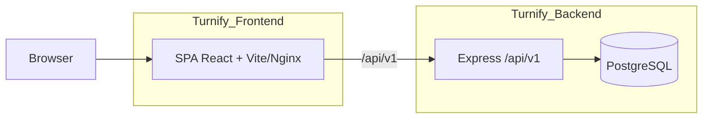
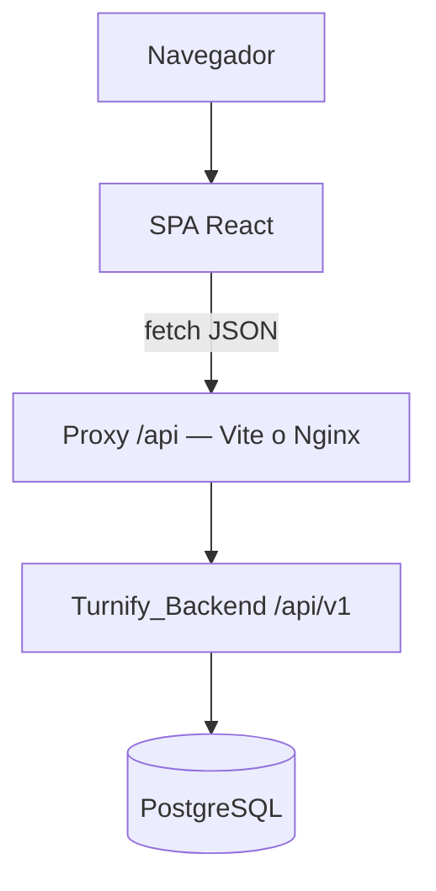
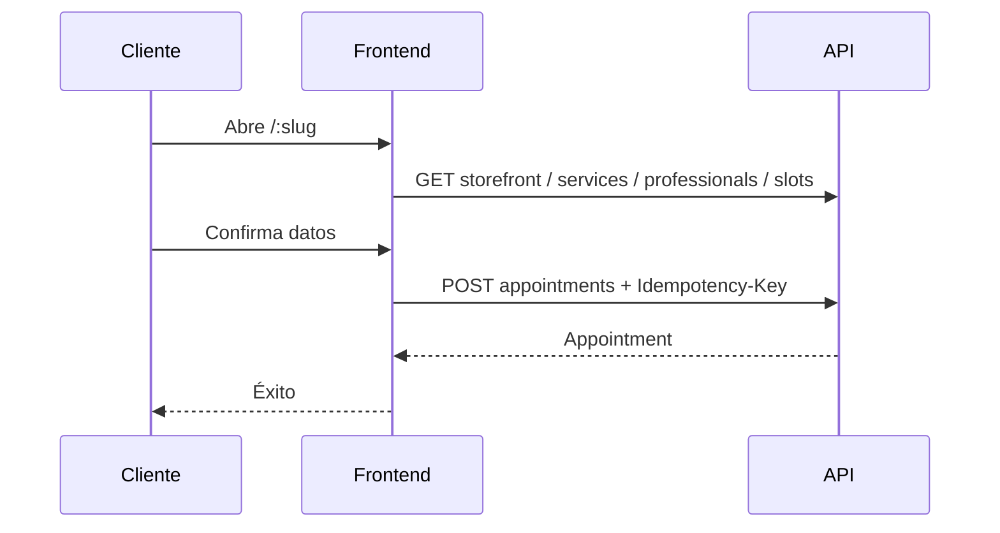
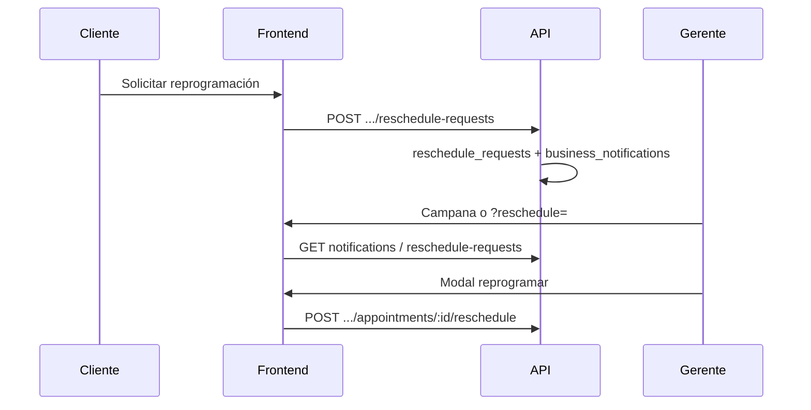
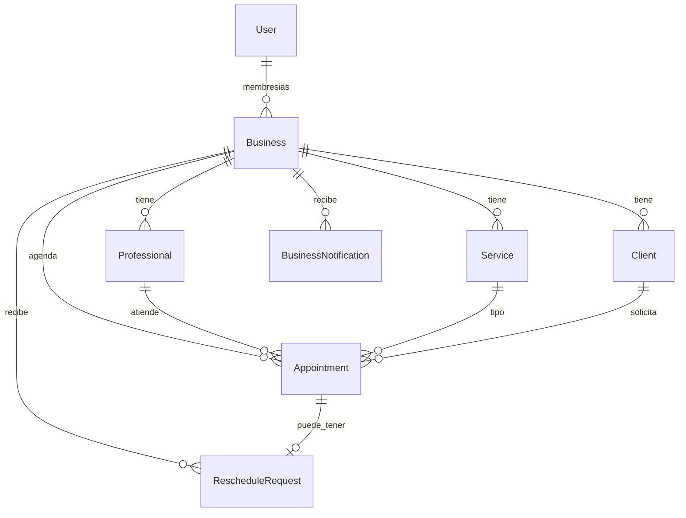
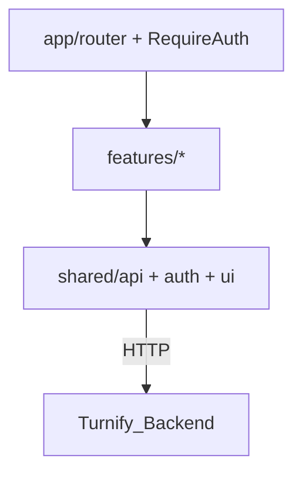
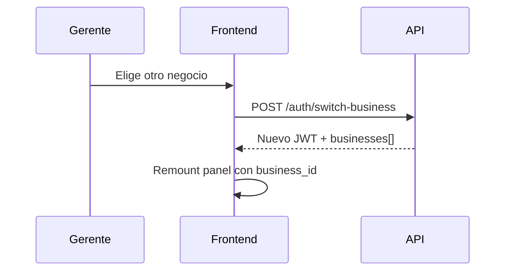

# Sustentación Turnify Frontend

**Proyecto:** Turnify Frontend (SPA multi-tenant de citas)  
**Contexto:** MVP SaaS — San José de Cúcuta / evaluación académica  
**Público:** perfiles técnicos, evaluadores académicos y personas no técnicas  
**Repo:** `Turnify_Frontend` (capa de presentación; backend independiente: `Turnify_Backend`)  
**Última revisión al código:** 27 julio 2026

---

## 0. Instrucciones de redacción (brief original) y metodología

Este documento existe porque se pidió documentación de sustentación con un brief concreto. Se conserva aquí para que sepas **qué debías entregar** y **bajo qué reglas se escribió**.

### 0.1 Brief del usuario (texto de pedido)

> Eres un experto en documentación de software, arquitectura de sistemas y comunicación técnica. Tengo este proyecto que debo sustentar y exponer ante un público que incluye perfiles técnicos, evaluadores académicos y personas sin conocimiento técnico. Necesito que analices el proyecto completo y generes toda la documentación necesaria para que yo pueda entenderlo en profundidad y defenderlo ante cualquier tipo de pregunta.
>
> El entregable debe incluir:
>
> 1. **Resumen ejecutivo** — qué es el proyecto, qué problema resuelve y cuál es su propuesta de valor, explicado en lenguaje simple.
> 2. **Documentación técnica** — arquitectura del sistema, tecnologías usadas y por qué se eligieron, estructura de carpetas y archivos clave, flujo de datos, endpoints o funciones principales, base de datos (modelo de datos, relaciones), dependencias y configuración del entorno.
> 3. **Documentación pedagógica** — analogías y ejemplos del mundo real para explicar los conceptos más complejos, glosario de términos técnicos con definición sencilla, y una guía de «¿cómo funciona esto?» que cualquier persona pueda seguir.
> 4. **Preguntas y respuestas preparadas** — banco de al menos 20 preguntas de sustentación, separadas por perfil (técnico, académico/docente, usuario final), con respuestas completas.
> 5. **Diagrama de flujo o arquitectura** — representación visual del sistema y cómo interactúan sus partes.
> 6. **Justificación de decisiones** — por qué se tomaron las decisiones de diseño, tecnología y estructura (incluyendo alternativas descartadas y el motivo).

### 0.2 Regla de imparcialidad (segunda instrucción)

> No se debe tener en cuenta la carpeta `docs/` como **fuente** al analizar el proyecto, porque puede sesgar e impedir objetividad. La sustentación debe basarse en **código y configuración ejecutable**.

**Cómo se aplica hoy:**

| Rol de `docs/` | Uso permitido |
|----------------|---------------|
| Como **entrada** para inventar features | No |
| Este archivo (`sustentacion-turnify.md`) | Es el **entregable**, no la fuente |
| `docs/frontend-api-contract.md` | Solo como **mapa** de lo que el código ya llama vía `shared/api/*` |
| `PRODUCT.md` / `DESIGN.md` / `README.md` | Referencia de producto/arranque; las afirmaciones de “qué hace el sistema” se contrastan con `frontend/src` |

### 0.3 Fuentes permitidas (metodología vigente)

1. `frontend/src/**` (rutas, features, shared, UI)
2. `frontend/package.json`, `vite.config.ts`, `tsconfig*`, nginx template
3. `Dockerfile`, `docker-compose.yml`, `.env.example`, `.env.docker.example`
4. Tipos y wrappers HTTP (`shared/api/*`, `features/*/api.ts`) — reflejan el contrato real
5. Repo hermano **Turnify_Backend** solo para confirmar que existen tablas/endpoints que el front ya invoca (no se inventa dominio que el front no use)

**Leyenda usada en el texto:**

- **Hecho** — aparece en código/config.
- **Inferido** — explicación razonable; no está escrita literal en el código.
- **Fuera de este repo** — vive en Turnify_Backend / infraestructura.

### 0.4 Mapa de secciones ↔ brief

| # del brief | Sección en este documento |
|-------------|---------------------------|
| Resumen ejecutivo | §1 |
| Documentación técnica | §2 |
| Documentación pedagógica + glosario/parámetros | §3 |
| Diagramas | §2 (embebidos) + §4 |
| Justificación de decisiones | §5 |
| Preguntas y respuestas (≥20) | §6 |
| Extra estudio | §7 guión, §8 archivos, §9 checklist, §10 conclusión |

---

## 1. Resumen ejecutivo

### 1.1 Qué es

Turnify Frontend es la **interfaz web** de un sistema de citas para negocios de servicios. En el navegador permite:

1. Que un **cliente** reserve, cancele, consulte citas y **solicite reprogramación** sin registrarse (`/:slug`, `/mis-citas`, `/cancel/:id`).
2. Que un **gerente** administre catálogo, horarios, agenda, clientes, **varios negocios** con la misma cuenta y reciba **notificaciones** (`/app`).
3. Que un **administrador de plataforma** gestione tenants (`/platform`).

Todo lo visible es React en el cliente; datos y reglas los responde una **API REST** `/api/v1/...` en **Turnify_Backend**.

### 1.2 Qué problema resuelve

Concentra en un solo producto web:

- reserva online guiada (servicio → profesional → horario → datos),
- operación diaria (crear, cancelar, reprogramar, completar, no-show),
- solicitudes de reprogramación del cliente **persistidas en servidor**,
- notificaciones al negocio (API + algunas alertas calculadas en cliente),
- configuración de oferta y disponibilidad,
- multi-negocio por gerente y administración SaaS por plataforma.

### 1.3 Propuesta de valor

| Para quién | Valor observable |
|------------|------------------|
| Cliente | Reservar, cancelar, ver citas y pedir reprogramación con enlace + teléfono |
| Gerente | Panel: agenda, servicios, equipo, horarios, clientes, perfil, selector de negocio, campana |
| Plataforma | Alta/suspensión de negocios, gerentes N:N, health y logs |

### 1.4 Relación frontend ↔ backend

| Aspecto | Este repo | Turnify_Backend |
|---------|-----------|-----------------|
| Puerto típico | Vite `:5173` o Docker `:8080` | `:3000` |
| Responsabilidad | UI, rutas, sesión, fetch | Reglas, JWT, PostgreSQL |
| OpenAPI | No | `http://localhost:3000/api-docs` |



### 1.5 Límites honestos (código)

- Sin API no hay datos reales.
- Sesión JWT en `localStorage` (no cookie HttpOnly).
- `/mis-citas` agrega lookups de negocios **recordados en el dispositivo**; no hay lookup cross-tenant en servidor.
- Notificaciones **híbridas**: servidor (cancelación, reprogramación) + cliente (vencidas, agenda casi llena).
- Tests Vitest acotados (3 archivos); sin E2E.
- Legacy: `rescheduleRequestStorage.ts` ya **no persiste** solicitudes; al boot se purgan claves `turnify.rescheduleRequests.*`.

---

## 2. Documentación técnica

### 2.1 Arquitectura del sistema



**Hecho:** `docker-compose.yml` de este repo solo define `frontend`. Postgres y API están en el compose del backend.

### 2.2 Superficies y rutas (`app/router.tsx`)

| Prefijo | Guard | Páginas |
|---------|-------|---------|
| Público | — | `/:slug`, `/:slug/mis-citas`, `/mis-citas`, `/cancel/:appointmentId` |
| Negocio | `RequireAuth scope="business"` | `/app` (dashboard, appointments, services, professionals, availability, clients, profile, **businesses/new**) |
| Plataforma | `RequireAuth scope="platform"` | `/platform` (dashboard, businesses, detail, log-viewer, health, account) |
| Auth | — | `/`, `/login`, `/register`, `/forgot-password`, `/reset-password` |

### 2.3 Stack (`frontend/package.json`)

| Tecnología | Rol |
|------------|-----|
| React 19 + react-dom | UI |
| React Router 7 | Rutas, guards, lazy |
| Vite 8 | Dev server + build |
| TypeScript ~6 | Tipado (`tsc -b` en build) |
| Tailwind 4 | Estilos utilitarios |
| sonner | Toasts |
| clsx + CVA | Variantes de componentes |
| Vitest, oxlint | Tests / lint |
| `fetch` nativo | HTTP (`shared/api/client.ts`) |

**No hay:** Redux, React Query, Axios, Next.js, MUI/Chakra.

### 2.4 Estructura de carpetas

```
frontend/src/
  app/                 # router, RequireAuth
  features/
    auth/              # login, register, passwords, HomePage, switchBusiness
    app/               # AppShell, BusinessSwitcher, CreateManagedBusinessPage
    public-booking/    # wizard, cancel, mis-citas, PublicRescheduleRequestModal
    dashboard/
    appointments/      # agenda + ?reschedule= / ?focus=
    catalog/           # services, professionals
    availability/
    clients/
    business-profile/
    platform/
    notifications/     # campana, hooks, builders
  shared/
    api/               # client, business, public, types, errores
    auth/              # session + AuthContext
    config/env.ts
    datetime/
    ui/                # atoms → templates, glass, ShellLayouts, BrandAtmosphere
    storage/           # clientAppointmentsStorage; legacy reschedule (solo tipo + purge)
  App.tsx, main.tsx, index.css
```

Patrón: **feature folders** + **shared** transversal. Páginas **lazy** + `Suspense`.

### 2.5 Autenticación y multi-negocio

Archivos: `session.ts`, `AuthContext.tsx`, `RequireAuth.tsx`, `features/auth/api.ts`, `BusinessSwitcher.tsx`.

1. Login/register → `access_token`, `scope`, `business_id`, `businesses[]`.
2. Persistencia: `localStorage` clave `turnify.session`.
3. Requests `auth: true` → `Authorization: Bearer …`.
4. `RequireAuth` valida sesión y `scope`.
5. 401 / `ACCESS_DISABLED` → `clearSession()`.
6. **Cambiar negocio:** `POST /auth/switch-business` `{ business_id }` → nuevo JWT.
7. **Crear otro negocio (misma cuenta):** `POST /business/managed-businesses` → JWT ya apuntando al nuevo tenant (`/app/businesses/new`).
8. Registro con email/documento existentes: el front puede hacer login + `createManagedBusiness` (mitiga conflicto de `/auth/register`).

**No en cliente:** refresh token; bootstrap con `GET /auth/me` al arrancar (la función `me()` existe pero no se invoca en boot).

### 2.6 Endpoints que el código llama

Cliente: `apiRequest` → `${API_V1}${path}`.

#### Auth (`features/auth/api.ts`)

| Método | Path |
|--------|------|
| POST | `/auth/register` |
| POST | `/auth/login` |
| GET | `/auth/me` |
| POST | `/auth/switch-business` |
| POST | `/auth/forgot-password` |
| POST | `/auth/reset-password` |
| POST | `/auth/change-password` |

#### Public (`shared/api/public.ts`)

| Método | Path | Notas |
|--------|------|-------|
| GET | `/public/businesses/:slug` | Storefront |
| GET | `.../services`, `.../professionals`, `.../slots` | Wizard |
| POST | `.../appointments` | Header `Idempotency-Key` |
| POST | `/public/appointments/:id/cancel` | `{ phone }` |
| POST | `/public/appointments/:id/reschedule-requests` | `{ phone, message }` |
| POST | `.../appointments/lookup` | `{ phone }` |

#### Business (`shared/api/business.ts`) — extracto

- Profile, dashboard, services, professionals, schedules, exceptions
- Appointments: list/create/get + cancel / reschedule / complete / no-show
- Clients: list/PATCH + block/unblock
- `POST /business/managed-businesses`
- Notifications: `GET/PATCH .../notifications`, `POST .../mark-all-read`
- Reschedule requests: `GET/PATCH .../reschedule-requests`

#### Platform (`features/platform/api.ts`)

Dashboard, businesses CRUD/status, managers, health, log-viewer.

#### Errores

Envelope: `{ error: { code, message, details? } }` → `ApiError` + `errorMessages.ts` (ver §3.4 códigos).

### 2.7 Flujos principales

#### Reserva pública



#### Reprogramación (solicitud en servidor)



#### Notificaciones (híbrido)

| Origen | Qué | Cómo |
|--------|-----|------|
| Servidor | Cancelación, solicitud reprogramación | `GET /business/notifications` |
| Cliente | Cita vencida, agenda casi llena | `buildBusinessNotifications` |

Poll ~30 s en `useBusinessNotifications`; deep-links `?focus=` / `?reschedule=`.

### 2.8 Modelo de datos (vista del frontend)

**Hecho:** no hay SQL en este repo. Tipos en `shared/api/types.ts`.



**Fuera de este repo (backend):** tablas `reschedule_requests`, `business_notifications`, etc.

### 2.9 Entorno y variables

| Variable / mecanismo | Comportamiento |
|----------------------|----------------|
| `VITE_API_BASE_URL` undefined | Base `http://localhost:3000` → `/api/v1` |
| `VITE_API_BASE_URL` vacío | Same-origin `/api/v1` (proxy Vite/Nginx) |
| `VITE_PROXY_TARGET` | Destino del proxy Vite (local: `http://localhost:3000`) |
| `BACKEND_SCHEME` + `BACKEND_UPSTREAM` | Nginx en Docker (local: `http` + `host.docker.internal:3000`) |
| `FRONTEND_PORT` | Puerto host del contenedor UI (default `8080`) |

```bash
# Backend (Turnify_Backend) → :3000
# Frontend Docker (este repo)
cp .env.docker.example .env
docker compose up --build   # http://localhost:8080

# o Vite
cd frontend && cp .env.example .env
npm install && npm run dev  # http://localhost:5173
```

> Un JWT del backend **remoto** no vale en local: hay que volver a iniciar sesión.

### 2.10 UI / glass / atmósfera

- Design system: `shared/ui` (atoms → templates).
- Glass: `shared/ui/lib/glass.ts` + reglas `.glass-*` en `index.css`.
- Shell negocio: header teal, sidebar clara, contenido con **BrandAtmosphere** (mesh CSS; ya no wallpaper fotográfico como fondo principal).
- Tokens: brand teal, `--color-card` crema cálida (mezcla con arena `#E0CD95`), Manrope.

### 2.11 Tests

1. `shared/api/errorMessages.test.ts`
2. `shared/datetime/index.test.ts`
3. `features/notifications/buildBusinessNotifications.test.ts`

### 2.12 Deuda / puntos débiles (útiles en oral)

| Tema | Nota |
|------|------|
| Token en localStorage | Riesgo XSS vs simplicidad SPA |
| Sin `/auth/me` al boot | Se confía en storage hasta 401 |
| `/mis-citas` | Solo negocios del dispositivo |
| Notificaciones derivadas | No están en DB |
| Staff slots | Agenda gerente usa endpoints `/public/.../slots` |
| Tests UI | Escasos |
| Bug histórico status | Join Business+Appointment podía pisar `status` en backend; cancel/reprogram fallaban con `INVALID_STATE_TRANSITION` — fix en backend (cargar business aparte) |

### 2.13 Qué NO es “engaño” de navegador

| Sí API (fuente de verdad) | Solo UX en dispositivo |
|---------------------------|-------------------------|
| Citas, cancel, reprogram requests | `turnify.session` (JWT) |
| Notificaciones de negocio | Teléfono / slugs de `/mis-citas` |
| Agenda, catálogo, platform | `turnify.lastAppointment`, teléfono por slug |
| | Dismiss local de alertas platform |

---

## 3. Documentación pedagógica

### 3.1 Orden de estudio recomendado

1. `main.tsx` → `App.tsx` → `router.tsx` → `RequireAuth.tsx`
2. `shared/api/client.ts` → `types.ts` → `business.ts` / `public.ts`
3. `session.ts` → `AuthContext.tsx` → `BusinessSwitcher.tsx`
4. `PublicBookingPage` → `MyAppointmentsPage` → `PublicRescheduleRequestModal`
5. `AppShell` → `AppointmentsPage` → `RescheduleModal`
6. `useBusinessNotifications` → `NotificationBell`
7. `ShellLayouts` → `BrandAtmosphere` → `glass.ts` → `index.css`
8. OpenAPI backend + este documento §2.6

### 3.2 Analogías

| Concepto | Analogía |
|----------|----------|
| SPA | Edificio: cambias de piso (ruta) sin salir a la calle |
| `features/` | Departamentos del negocio |
| `shared/` | Servicios centrales (seguridad, mensajería) |
| JWT | Credencial en el bolsillo del navegador |
| `scope` | Empleado de una tienda vs gerente del centro comercial |
| Proxy `/api` | Recepcionista que reenvía al almacén |
| Idempotency-Key | Número de ticket: reenviar no duplica el pedido |
| Multi-negocio | Un mismo dueño con varias sedes; el JWT dice en cuál estás hoy |
| Notificación servidor vs derivada | Aviso en buzón oficial vs recordatorio en tu pizarra |
| Reprogramación pública | Nota al mostrador; el staff confirma el nuevo horario |
| Slug | Dirección corta del local en internet (`/mi-barberia`) |

### 3.3 Guía «¿cómo funciona?» (no técnico)

1. Arrancas backend (`:3000`) y frontend (`:8080` o `:5173`).
2. El navegador carga la SPA.
3. Cada pantalla pide JSON a `/api/v1/...`.
4. Si hay login, manda el token.
5. La UI muestra datos o un mensaje de error en español.
6. Cancelar o pedir reprogramación escribe en la base del servidor; el gerente lo ve en la campana (otro dispositivo también).
7. Si el token es inválido, te manda a `/login`.

### 3.4 Glosario y parámetros (términos juntos)

#### Actores y dominio

| Término | Código / valor | Definición sencilla |
|---------|----------------|---------------------|
| Cliente | entidad `Client` | Persona que reserva sin cuenta |
| Gerente | membership `manager` / `scope: business` | Opera un negocio (o varios) |
| Admin plataforma | `scope: platform` | Administra el SaaS |
| Empleado / profesional | `Professional` | Atiende citas; **sin login** en MVP |
| Negocio / tenant | `Business` | Unidad aislada por `business_id` |
| Cita | `Appointment` | Reserva con inicio/fin y estado |
| Slug | `business.slug` | Segmento URL público |
| Vitrina | rutas públicas `/:slug` | Página de reserva del negocio |

#### Scopes, estados y canales

| Parámetro | Valores | Significado |
|-----------|---------|------------|
| `scope` | `business` \| `platform` | Rol del JWT / sesión |
| `Appointment.status` | `confirmed` \| `cancelled` \| `completed` \| `no_show` | Ciclo de vida de la cita |
| `Business.status` | `active` \| `suspended` | Vitrina abierta/cerrada (gerente) o baja SaaS (platform) |
| `Professional.status` | `active` \| `inactive` | Disponible / bloqueado |
| `Appointment.channel` | `self_service` \| `staff` | Reservó el cliente o el gerente |
| `RescheduleRequest.status` | `pending` \| `seen` \| `handled` \| `dismissed` | Ciclo de la solicitud |
| `BusinessNotification.status` | `unread` \| `read` \| `dismissed` | Lectura en campana |
| `BusinessNotification.type` | p. ej. `appointment_cancelled`, `reschedule_request` | Motivo del aviso |

#### Auth / sesión (parámetros)

| Campo | Dónde | Notas |
|-------|-------|-------|
| `access_token` | login/register/switch | JWT Bearer |
| `token_type` | respuesta auth | Normalmente `Bearer` |
| `expires_in` | respuesta auth | Segundos de vida |
| `business_id` | sesión activa | Tenant actual del gerente |
| `businesses[]` | `{ id, name, slug, status? }` | Membresías del usuario |
| `document` | register | Documento del gerente |
| `turnify.session` | localStorage | Persistencia cliente |

#### Cita / reserva (parámetros frecuentes)

| Campo | Notas |
|-------|-------|
| `starts_at` / `ends_at` | ISO 8601 UTC |
| `professional_id`, `service_id`, `client_id` | UUIDs |
| `forced` | Reserva staff forzando reglas (API business) |
| `cancellation_min_hours` | Ventana mínima para cancelar (perfil negocio) |
| `Idempotency-Key` | Header en POST reserva pública |
| `phone` | Verificación cancel / lookup / reschedule-request |
| `message` | Texto de solicitud de reprogramación (mín. 8 chars en UI) |
| `timezone` | Default `America/Bogota` |

#### Paginación y filtros

| Parámetro | Uso |
|-----------|-----|
| `limit`, `offset` | Listados `{ total, items }` |
| `from`, `to` | Rango de citas (ISO) |
| `status` | Filtro citas / notificaciones / reschedule-requests |
| `q` | Búsqueda clientes |
| `date` | Slots `YYYY-MM-DD` |

#### Códigos de error API (mapeados en UI)

| `error.code` | Mensaje orientativo en UI |
|--------------|---------------------------|
| `VALIDATION_ERROR` | Revisa el formulario |
| `UNAUTHENTICATED` | Debes iniciar sesión |
| `INVALID_CREDENTIALS` | Correo o contraseña incorrectos |
| `FORBIDDEN` | Sin permiso |
| `ACCESS_DISABLED` | Negocio dado de baja |
| `BUSINESS_SUSPENDED` | Negocio suspendido |
| `CLIENT_BLOCKED` | Cliente bloqueado |
| `NOT_FOUND` | No encontrado |
| `SLOT_OCCUPIED` | Horario ocupado |
| `PROFESSIONAL_INACTIVE` | Profesional no disponible |
| `INVALID_STATE_TRANSITION` | Cita ya no confirmada / transición inválida |
| `SLUG_ALREADY_EXISTS` / `EMAIL_ALREADY_REGISTERED` / `DOCUMENT_ALREADY_REGISTERED` | Conflictos de unicidad |
| `CONFLICT` | Conflicto genérico |
| `OUTSIDE_AVAILABILITY` | Fuera de horario |
| `CANCELLATION_TOO_LATE` | Fuera de ventana de cancelación |
| `CLIENT_APPOINTMENT_LIMIT` | Límite de citas |
| `INTERNAL_ERROR` / `PROXY_ERROR` / `NETWORK_ERROR` | Fallos infra / red |

#### Claves localStorage (honestidad)

| Clave | Propósito |
|-------|-----------|
| `turnify.session` | JWT + scope + business_id |
| `turnify.client.phone` | Teléfono recordado mis-citas |
| `turnify.client.businesses` | Slugs visitados |
| `turnify.lastAppointment` | Atajo post-reserva |
| `turnify.phone.:slug` | Teléfono por negocio |
| `turnify.notifications.readIds` | Dismiss platform (derivadas) |
| `turnify.rescheduleRequests.*` | **Legacy**; se purga al arrancar |

#### Términos de arquitectura / web

| Término | Definición sencilla |
|---------|---------------------|
| Frontend | Código en el navegador |
| Backend / API | Servidor con reglas y datos |
| SPA | Una carga inicial; navegación sin recargar toda la página |
| Endpoint | URL + método HTTP |
| REST | Estilo de API por recursos HTTP |
| JWT | Token firmado de sesión |
| Multi-tenant | Varios negocios aislados en un mismo sistema |
| Proxy | Reenvío de `/api` al backend (CORS) |
| Lazy loading | Cargar pantallas al entrar |
| Deep-link | URL con query que abre un flujo (`?reschedule=`) |
| DTO | Forma JSON tipada que espera el front |
| Glass UI | Superficie semitransparente + blur |
| Idempotencia | Misma petición no crea dos veces el mismo efecto |
| OpenAPI | Documento de la API del backend |
| Feature folder | Carpeta por dominio de producto |
| Guard / RequireAuth | Componente que bloquea rutas sin sesión/rol |
| Heurística | Regla calculada en cliente (p. ej. “casi llena”) |

---

## 4. Diagramas adicionales

### Capas internas



### Post-login y público

```mermaid
flowchart TD
  L[Login API] --> S{scope?}
  S -->|business| APP[/app + BusinessSwitcher]
  S -->|platform| PLAT[/platform]
  PUB[/:slug o /mis-citas] --> W[Reserva / consulta / reprogramación]
```

### Multi-negocio



---

## 5. Justificación de decisiones

**Leyenda:** Observado = en código. Inferido = plausible.

| Decisión | Tipo | Alternativas | Motivo |
|----------|------|--------------|--------|
| SPA React + Vite | Observado | Next.js | Panel + vitrina sin SSR obligatorio |
| Guards por scope | Observado | Dos apps | Una base UI |
| Feature folders | Observado | `pages/` plano | Cohesión por dominio |
| `apiRequest` único | Observado | Axios suelto | Auth/errores/base URL centralizados |
| Sin Redux/React Query | Observado | Estado global | Context auth; fetch por pantalla |
| Notificaciones híbridas | Observado | Solo push | Eventos reales en DB + heurísticas baratas |
| Reprogramación vía API | Observado | Solo localStorage / WhatsApp | Multi-dispositivo y campana |
| Multi-negocio N:N | Observado | Un usuario = un negocio | Dueños con varias sedes |
| Tailwind + UI propia | Observado | MUI | Control visual |
| Sesión localStorage | Observado | Cookie HttpOnly | Simplicidad SPA |
| Docker solo frontend | Observado | Monolito | Despliegue desacoplado |
| Tests acotados | Observado | E2E full | Utilidades críticas primero |

### Trade-offs a admitir

1. Token en localStorage (XSS).
2. Reprogramación pública = solicitud, no autoservicio de slot.
3. `/mis-citas` depende del dispositivo.
4. Notificaciones derivadas no persistidas.
5. Dependencia total del backend para demo E2E.
6. Acoplamiento agenda staff → slots públicos.

---

## 6. Preguntas y respuestas (≥ 24)

### Perfil técnico

**1. ¿Dónde está el backend?**  
En **Turnify_Backend**. Este front proxifica `/api/v1` con Vite o Nginx.

**2. ¿Cómo se separan gerente y admin?**  
`scope` en sesión + `RequireAuth` + rutas `/app` vs `/platform`.

**3. ¿Qué ocurre en un 401?**  
`clearSession()`, AuthContext se entera, guard → `/login`.

**4. ¿Por qué feature-based?**  
Agrupa pantallas/APIs por dominio y facilita cambios localizados.

**5. ¿Usan Axios?**  
No: `fetch` en `client.ts`.

**6. ¿Hay refresh token?**  
No en el cliente actual.

**7. ¿Cómo evitan CORS en dev?**  
Proxy Vite `/api` → `VITE_PROXY_TARGET`; en Docker, Nginx → `BACKEND_UPSTREAM`.

**8. ¿La reprogramación pública usa API?**  
Sí: `POST /public/appointments/:id/reschedule-requests`. No depende de localStorage.

**9. ¿Qué tests hay?**  
Tres unitarios (errores, datetime, builder de notificaciones).

**10. ¿Dónde está el design system?**  
`shared/ui` + `index.css` + `glass.ts` + `BrandAtmosphere`.

**11. ¿Cómo funcionan las notificaciones?**  
`GET /business/notifications` + heurísticas en `buildBusinessNotifications`; poll 30 s.

**12. ¿Cómo funciona multi-negocio?**  
`businesses[]` + `BusinessSwitcher` + `POST /auth/switch-business`; alta extra con `managed-businesses`.

**13. ¿Por qué cancelar fallaba con INVALID_STATE_TRANSITION?**  
En backend, al cargar la cita con join al negocio, el campo `status` podía corromperse; el check de “solo confirmed” fallaba. Fix: cargar business aparte y revalidar status.

### Perfil académico / docente

**14. ¿Objeto de estudio de este repo?**  
Capa de presentación multi-rol, integración HTTP, UX de tres superficies, SPA desacoplada del dominio.

**15. ¿Clean Architecture?**  
Parcial en front (UI / sesión / HTTP). Dominio profundo en el backend.

**16. ¿Cohesión / acoplamiento?**  
Alta cohesión por features; acoplamiento consciente al contrato OpenAPI.

**17. ¿Qué metodología se ve?**  
Entrega incremental conectada a endpoints; tipado; Docker; iteración front+back (notificaciones, multi-negocio).

**18. ¿Limitaciones?**  
API externa, storage de sesión, tests UI, `/mis-citas` por dispositivo, heurísticas no persistidas.

**19. ¿Qué validar en demo?**  
Reserva → reprogramación en otro navegador → campana → reprogramar → cancelación con notificación; opcional switch de negocio.

**20. ¿Aporte?**  
SPA tipada, modular, desplegable sola, con roles, vitrina, reprogramación y notificaciones vía REST.

### Perfil usuario final / no técnico

**21. ¿Para qué sirve si tengo un negocio?**  
Clientes reservan por enlace; tú ves la agenda y avisos en la campana.

**22. ¿El cliente crea cuenta?**  
No en el flujo público.

**23. ¿Se mezclan mis citas con otro negocio?**  
En el panel, no: el token fija el negocio activo. En `/mis-citas` solo ves negocios que este teléfono/navegador ya usó.

**24. ¿Funciona sin el servidor?**  
La carcasa abre, pero no hay datos.

**25. ¿Sirve en el móvil?**  
Sí; layouts responsive.

**26. ¿Olvidé la contraseña?**  
`/forgot-password` y `/reset-password`.

**27. Si pido reprogramar, ¿el negocio lo ve en otro PC?**  
Sí: queda en base de datos y sale en la campana.

**28. ¿Puedo elegir yo el nuevo horario?**  
No en el MVP público: envías un mensaje; el negocio confirma.

**29. ¿Puedo tener dos locales con un solo correo?**  
Sí: selector de negocio o “Nuevo negocio” (`managed-businesses`).

---

## 7. Guión corto (3 minutos)

1. Este repo es el **frontend** de Turnify: tres experiencias en una SPA.
2. Se organiza por **features** + **shared** (API, auth, UI glass).
3. Habla con **Turnify_Backend** solo por **HTTP `/api/v1`**.
4. Roles: `business` → `/app` (multi-negocio); `platform` → `/platform`; público → `/:slug` y `/mis-citas`.
5. Demo: reserva → reprogramación desde otro dispositivo → campana → reprogramar / cancelar.
6. Límites: backend aparte; JWT en localStorage; notificaciones híbridas; tests acotados.

---

## 8. Archivos clave

| Tema | Archivo |
|------|---------|
| Brief / este doc | `docs/sustentacion-turnify.md` |
| Rutas | `frontend/src/app/router.tsx` |
| Guard | `frontend/src/app/RequireAuth.tsx` |
| Sesión | `shared/auth/session.ts`, `AuthContext.tsx` |
| Switch negocio | `features/app/BusinessSwitcher.tsx`, `features/auth/api.ts` |
| Nuevo negocio | `features/app/CreateManagedBusinessPage.tsx` |
| HTTP | `shared/api/client.ts` |
| Tipos / errores | `shared/api/types.ts`, `errorMessages.ts` |
| API negocio / pública | `shared/api/business.ts`, `public.ts` |
| Reprogramación cliente | `PublicRescheduleRequestModal.tsx` |
| Agenda + deep-links | `AppointmentsPage.tsx` |
| Notificaciones | `useBusinessNotifications.ts`, `NotificationBell.tsx` |
| Mis citas | `MyAppointmentsPage.tsx` |
| Shell / atmósfera | `ShellLayouts.tsx`, `BrandAtmosphere.tsx`, `glass.ts` |
| Purge legacy | `main.tsx`, `rescheduleRequestStorage.ts` |
| Docker / Vite | `docker-compose.yml`, `Dockerfile`, `vite.config.ts` |
| Contrato | `docs/frontend-api-contract.md` |
| Producto / README | `PRODUCT.md`, `README.md` |

---

## 9. Checklist de estudio

- [ ] Leer §0 (brief + metodología) y §3.4 (glosario/parámetros)
- [ ] Levantar backend `:3000` y frontend `:8080` o `:5173`
- [ ] Confirmar en red que las llamadas van al **local**, no al remoto
- [ ] Registrar / login gerente; anotar slug
- [ ] Crear segundo negocio y cambiar con el selector
- [ ] Reservar cita pública; abrir `/mis-citas`
- [ ] Solicitar reprogramación; ver campana en otro contexto
- [ ] Reprogramar desde panel (`?reschedule=`)
- [ ] Cancelar públicamente; ver notificación
- [ ] Distinguir ids `server:` vs `expired:` / `full:` en el hook
- [ ] `npm test` en `frontend/`
- [ ] Explicar en voz alta un trade-off de §5

---

## 10. Conclusión objetiva

Turnify Frontend es una **SPA React** con tres superficies (pública, negocio, plataforma), autenticación JWT en `localStorage`, cliente HTTP único hacia `/api/v1`, design system glass/atmósfera, multi-negocio, reprogramación y notificaciones de negocio vía API, y empaquetado Docker desacoplado del backend.

El valor para sustentación está en: (1) arquitectura de presentación verificable en código, (2) flujos end-to-end con Turnify_Backend, (3) glosario/parámetros para hablar con precisión, y (4) honestidad sobre límites (storage, heurísticas, tests, dependencia del API).

*Fin del documento — elaborado según el brief de §0; fuente principal: código y configuración de Turnify_Frontend (julio 2026).*
