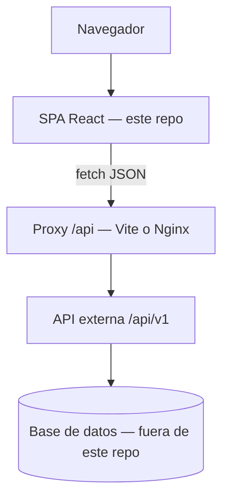
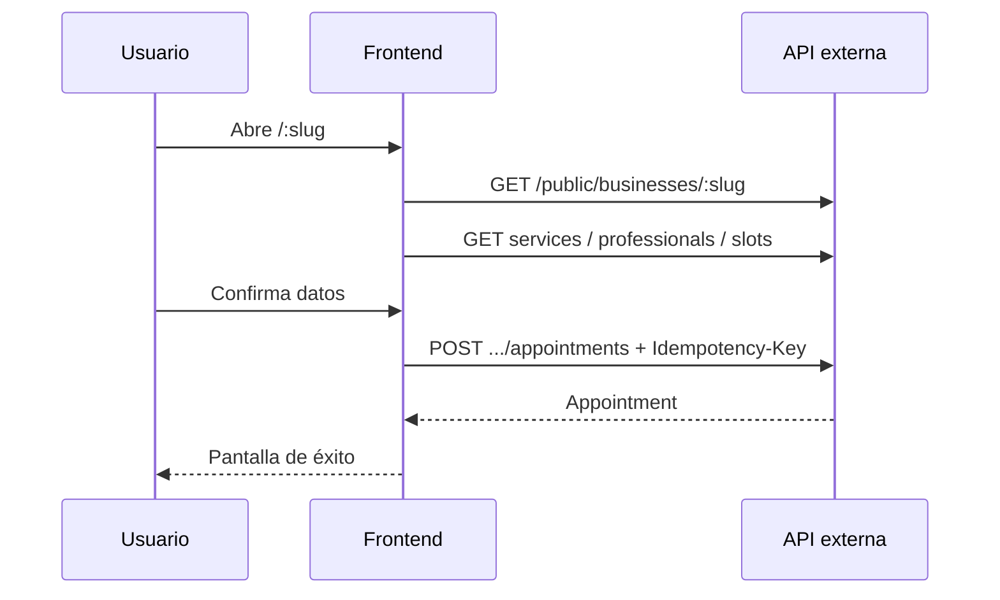
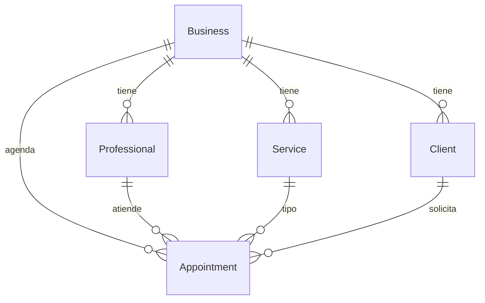
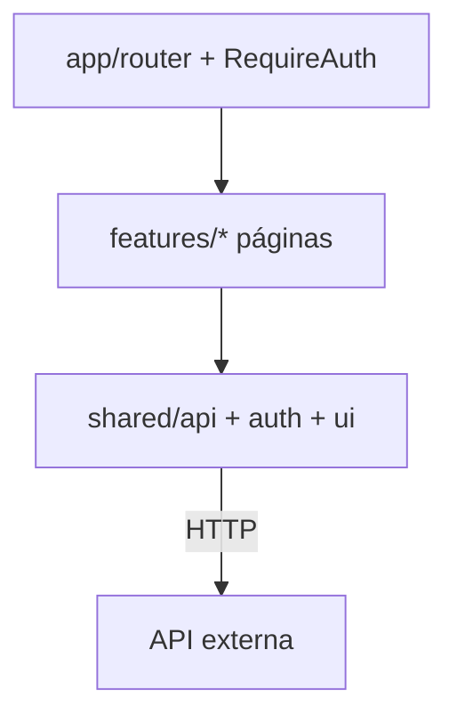

# Sustentación Turnify Frontend

**Metodología de este documento:** elaborado **únicamente** a partir del código ejecutable y la configuración del repositorio (`frontend/src`, `package.json`, Docker, Vite, env examples).  
**No** se usó la carpeta `docs/` ni narrativas de producto preescritas como fuente, para evitar sesgo.  
Donde algo no aparece en el código, se dice explícitamente.

**Qué es este repo en la práctica:** una aplicación web (SPA) de interfaz. **No incluye** el servidor de negocio ni la base de datos.

---

## 1. Resumen ejecutivo

### Qué es

Turnify Frontend es la interfaz web de un sistema de **citas para negocios de servicios**. En el navegador permite:

1. Que un **cliente** reserve en la página pública de un negocio (`/nombre-del-negocio`) sin registrarse.  
2. Que un **gerente** administre catálogo, horarios, agenda y clientes (`/app`).  
3. Que un **administrador de plataforma** gestione varios negocios (`/platform`).

Todo lo que ves es React en el cliente; los datos y las reglas las responde una **API externa** en `/api/v1/...`.

### Qué problema ataca (inferido del software)

El software concentra en un solo producto web:

- reserva online guiada (servicio → profesional → horario → datos),  
- operación diaria de citas (crear, cancelar, reprogramar, completar, no-show),  
- configuración de oferta y disponibilidad,  
- administración de múltiples negocios con roles distintos (`business` vs `platform`).

### Propuesta de valor (observable)

| Para quién | Valor que la app entrega |
|------------|---------------------------|
| Cliente | Reservar/cancelar/consultar citas con enlace y teléfono |
| Gerente | Panel único: agenda, servicios, equipo, horarios, clientes, perfil |
| Plataforma | Alta de negocios, suspensión, gerentes, health y logs |

### Límites honestos (porque el código lo muestra)

- Este repositorio **no es el sistema completo**: sin API no hay datos reales.  
- La sesión se guarda en `localStorage` (no cookies HttpOnly).  
- La “solicitud de reprogramación” pública se guarda en el **navegador** (`localStorage`), no hay endpoint público de reprogramación en el código.  
- Hay pocos tests automatizados (3 archivos Vitest).

---

## 2. Documentación técnica (basada en código)

### 2.1 Arquitectura del sistema



**Hecho verificable:** `docker-compose.yml` solo define servicios `frontend` / `frontend-prod`. No hay contenedor de API ni Postgres en este compose.

### 2.2 Tres superficies (router real)

Fuente: `frontend/src/app/router.tsx`.

| Prefijo | Guard | Páginas cargadas (lazy) |
|---------|-------|-------------------------|
| Público | ninguno | `/:slug`, `/:slug/mis-citas`, `/cancel/:appointmentId` |
| Negocio | `RequireAuth scope="business"` | `/app` dashboard, appointments, services, professionals, availability, clients, profile |
| Plataforma | `RequireAuth scope="platform"` | `/platform` dashboard, businesses, detail, log-viewer, health, account |
| Auth | ninguno | `/`, `/login`, `/register`, `/forgot-password`, `/reset-password` |

### 2.3 Tecnologías (package.json) y lectura objetiva de “por qué”

| Tecnología | Evidencia | Lectura razonable |
|------------|-----------|-------------------|
| React 19 + react-dom | dependencies | UI por componentes |
| React Router 7 | dependencies + `router.tsx` | Rutas anidadas y guards |
| Vite 8 | devDependency + scripts | Dev server + build |
| TypeScript ~6 | tsconfig + `tsc -b` en build | Tipado estático |
| Tailwind 4 + plugin Vite | dependencies | Utilidades CSS |
| sonner | `App.tsx` Toaster | Feedback toast |
| clsx + CVA | Button/ui | Variantes de componentes |
| Vitest, oxlint | scripts | Calidad mínima |
| fetch nativo | `shared/api/client.ts` | HTTP sin Axios |

**No aparecen** en dependencies: Redux, React Query, Axios, Next.js, MUI/Chakra.

Eso no prueba que “fueron descartados en un ADR”, solo que **el código actual no los usa**. La justificación de sección 6 distingue hechos vs inferencias.

### 2.4 Estructura de carpetas (real)

```
frontend/src/
  app/                 # router, RequireAuth
  features/
    auth/              # login, registro, passwords, HomePage, api.ts
    app/               # AppShell
    public-booking/    # wizard, cancel, mis-citas
    dashboard/
    appointments/
    catalog/           # services, professionals
    availability/
    clients/
    business-profile/
    platform/          # shell + páginas admin + api.ts
    notifications/     # campanas + builders
  shared/
    api/               # client, business, public, types, errores
    auth/              # session + AuthContext
    config/env.ts
    datetime/
    ui/                # atoms, molecules, organisms, templates
    hooks/, lib/, storage/
  App.tsx, main.tsx, index.css
```

Patrón observable: **organización por feature de UI** + **shared** transversal. Las páginas son lazy + `Suspense`.

### 2.5 Autenticación y sesión (código)

Archivos: `shared/auth/session.ts`, `AuthContext.tsx`, `RequireAuth.tsx`, `shared/api/client.ts`.

1. Login/register llaman API y reciben `access_token` + `scope` (+ `business_id` opcional).  
2. Se persiste en `localStorage` clave `turnify.session`.  
3. Requests con `auth: true` envían `Authorization: Bearer …`.  
4. `RequireAuth` bloquea sin sesión y redirige si el `scope` no coincide.  
5. Ante HTTP 401 (o código `ACCESS_DISABLED` en request autenticado) se limpia la sesión y el contexto React se pone en `null`.

**No implementado en el cliente:** refresh token; bootstrap con `GET /auth/me` (la función existe en `features/auth/api.ts` pero no hay imports en páginas).

### 2.6 Capa API y endpoints presentes en el código

Cliente único: `apiRequest` → `${API_V1}${path}`.

Prefijos usados:

- `/auth/*` — `features/auth/api.ts`  
- `/business/*` — `shared/api/business.ts`  
- `/public/*` — `shared/api/public.ts`  
- `/platform/*` — `features/platform/api.ts`

Ejemplos literales en código:

- `POST /auth/login`, `POST /auth/register`, `POST /auth/forgot-password`, `POST /auth/reset-password`, `POST /auth/change-password`  
- `GET/PATCH /business/profile`, `GET /business/dashboard`, CRUD services/professionals, weekly-schedule, availability-exceptions, appointments (+ cancel/reschedule/complete/no-show), clients (+ block/unblock)  
- `GET /public/businesses/:slug`, services, professionals, slots, `POST .../appointments` (+ header `Idempotency-Key`), cancel, lookup  
- `GET /platform/dashboard|health|log-viewer`, businesses CRUD/status, assign manager  

Errores esperados: JSON `{ error: { code, message, details? } }` → clase `ApiError` + mapa de mensajes.

### 2.7 Flujo de datos (reserva pública)



### 2.8 “Base de datos”

**Hecho:** no hay esquemas SQL, migraciones ni ORM en este repo.

**Inferencia limitada (solo tipos TypeScript en `shared/api/types.ts`):** el cliente conoce entidades como `Business`, `Service`, `Professional`, `Client`, `Appointment`, `WeeklySlot`, `AvailabilityException`, con relaciones implícitas por IDs (`professional_id`, `service_id`, `client_id`) y estados (`confirmed|cancelled|completed|no_show`, `active|suspended`, etc.).



Eso describe el **modelo que el front consume**, no prueba el esquema físico del servidor.

### 2.9 Dependencias y entorno

| Variable / mecanismo | Comportamiento en código/config |
|----------------------|----------------------------------|
| `VITE_API_BASE_URL` undefined | Base `http://localhost:3000` → `/api/v1` |
| `VITE_API_BASE_URL` vacío | Same-origin `/api/v1` |
| Proxy Vite `/api` | `vite.config.ts` → `VITE_PROXY_TARGET` (en Docker default `host.docker.internal:3000`) |
| Nginx prod | Proxy `/api/` → `BACKEND_UPSTREAM` |
| Dev Docker | `Dockerfile.dev`, puerto 5173, volumen de código + volumen `node_modules` |
| Prod Docker | Build estático + Nginx, puerto 8080 |

### 2.10 UI system

`shared/ui/index.ts` exporta un design system tipo Atomic Design (atoms → templates): Button, Input, FormField, Modal, ConfirmDialog, ShellFrame, etc. Estilos globales en `index.css` (Tailwind `@theme`, tipografía Manrope, colores brand).

### 2.11 Tests existentes

1. `shared/api/errorMessages.test.ts`  
2. `shared/datetime/index.test.ts`  
3. `features/notifications/buildBusinessNotifications.test.ts`  

No hay tests E2E ni de componentes React en el repo.

---

## 3. Documentación pedagógica

### 3.1 Analogías

| Concepto en el código | Analogía |
|-----------------------|----------|
| SPA | Un edificio: cambias de piso (ruta) sin salir a la calle (sin recargar todo) |
| `features/` | Departamentos de una empresa (caja, almacén, dirección) |
| `shared/` | Servicios centrales (seguridad, mensajería interna) |
| JWT en localStorage | Credencial digital guardada en el bolsillo del navegador |
| `scope=business` vs `platform` | Empleado de una tienda vs gerente del centro comercial |
| Proxy `/api` | Recepcionista que reenvía llamadas al almacén (API) |
| Multi-negocio vía API | Casilleros separados: misma app, llaves distintas en el servidor |
| Idempotency-Key | Número de ticket: reenviar el mismo ticket no duplica el pedido |

### 3.2 Glosario breve

| Término | Significado sencillo |
|---------|----------------------|
| Frontend | Código que corre en el navegador |
| Backend / API | Servidor que guarda datos y aplica reglas (fuera de este repo) |
| SPA | App web de una sola carga inicial |
| Endpoint | URL + método HTTP concreta |
| JWT / token | Cadena que prueba sesión y rol |
| Scope | Rol en el token: negocio o plataforma |
| Slug | Parte de la URL del negocio (`/mi-barberia`) |
| Lazy loading | Cargar pantallas solo cuando se necesitan |
| localStorage | Memoria del navegador que persiste al cerrar pestaña |

### 3.3 Guía “¿cómo funciona?” (paso a paso)

1. Arrancas el frontend (`npm run dev` o Docker).  
2. El navegador muestra rutas React.  
3. Cada pantalla pide datos con `fetch` a `/api/v1/...` (directo o vía proxy).  
4. Si hay login, el token viaja en el header `Authorization`.  
5. El servidor (no este repo) responde JSON; la UI lo muestra o muestra error.  
6. Si el token es inválido (401), la app borra la sesión y manda a `/login`.

---

## 4. Diagramas adicionales

### Capas internas del frontend



### Decisión de acceso

```mermaid
flowchart TD
  L[Login API] --> S{scope?}
  S -->|business| APP[/app]
  S -->|platform| PLAT[/platform]
  PUB[/:slug] --> W[Wizard reserva]
```

---

## 5. Justificación de decisiones

**Leyenda:**  
- **Observado:** se ve en el código.  
- **Inferido:** explicación plausible; no hay ADR obligatorio en el código fuente.

| Decisión | Tipo | Alternativas típicas | Argumento defendible |
|----------|------|----------------------|----------------------|
| SPA React + Vite | Observado | Next.js, CRA | Encaja con panel + vitrina sin SSR obligatorio; Vite acelera el ciclo de desarrollo |
| React Router con guards por scope | Observado | Apps separadas por rol | Una sola base de UI/auth; separación por prefijos `/app` y `/platform` |
| Feature folders | Observado | Carpetas `pages/` + `components/` planos | Agrupa pantallas y APIs por dominio de producto |
| `shared/api` + `apiRequest` | Observado | fetch suelto en cada página / Axios | Un solo lugar para auth header, errores y base URL |
| Sin Redux/React Query | Observado | Estado global de listas | Auth en Context; cada página carga y refresca lo suyo (más simple, más repetición) |
| Tailwind + UI propia | Observado | Librería de componentes pesada | Control visual y menos acoplamiento a un vendor |
| Sesión en localStorage | Observado | Cookie HttpOnly | Simple de implementar en SPA; **trade-off de seguridad** ante XSS |
| Docker solo frontend | Observado | Monolito full-stack en un compose | Permite API local, otra red o URL remota sin acoplar el código del servidor |
| Lazy routes | Observado | Bundle único | Reduce carga inicial |
| Tests unitarios acotados | Observado | E2E completo | Cubre utilidades críticas; **cobertura de UI baja** |

### Trade-offs que debes poder admitir en sustentación

1. **Seguridad de token en localStorage** vs comodidad SPA.  
2. **Reprogramación pública en localStorage** no sincroniza entre dispositivos ni es fuente de verdad del servidor.  
3. **Acoplamiento:** el modal de reprogramación del panel llama endpoints `/public/.../slots`.  
4. **Sin `/auth/me` al inicio:** se confía en lo guardado en storage hasta el primer 401.  
5. **Dependencia total del backend** para demostrar el producto de punta a punta.

---

## 6. Preguntas y respuestas (≥ 20)

### Perfil técnico

**1. ¿Dónde está el backend?**  
No en este repositorio. El front llama `/api/v1` vía `apiRequest`; Docker solo proxifica.

**2. ¿Cómo se separan gerente y admin?**  
Campo `scope` en la sesión (`business` | `platform`) + `RequireAuth` + rutas `/app` vs `/platform`.

**3. ¿Qué ocurre en un 401?**  
`clearSession()` limpia `localStorage`, notifica a `AuthContext` y el guard envía a `/login`.

**4. ¿Por qué feature-based?**  
Porque el árbol de `features/` agrupa pantallas y APIs por dominio (auth, appointments, platform…), lo que facilita localizar cambios.

**5. ¿Usan Axios?**  
No. `fetch` encapsulado en `shared/api/client.ts`.

**6. ¿Hay refresh token?**  
No aparece en el código del cliente.

**7. ¿Cómo evitan CORS en Docker?**  
En dev, proxy Vite de `/api` al target; en prod, Nginx reenvía `/api/`.

**8. ¿La reprogramación pública pega al API?**  
En el código actual, la solicitud se guarda en `localStorage` (`rescheduleRequestStorage`). No hay POST público de reprogramación.

**9. ¿Qué tests hay?**  
Tres: mensajes de error, datetime, builders de notificaciones business.

**10. ¿El design system dónde vive?**  
`frontend/src/shared/ui` con barrel `index.ts` (atoms/molecules/organisms/templates).

### Perfil académico / docente

**11. ¿Cuál es el objeto de estudio de este repo?**  
La capa de presentación de un sistema de citas multi-rol: organización del código, integración HTTP y UX de tres superficies.

**12. ¿Se puede hablar de Clean Architecture?**  
Parcialmente: hay separación UI / sesión / cliente HTTP. El dominio de negocio profundo no está aquí (está en la API).

**13. ¿Alta cohesión / bajo acoplamiento?**  
Cohesión por features: sí, visible. Acoplamiento al contrato API: inevitable. Acoplamiento entre features: bajo en teoría; hay casos (reprogramación staff → API public; notificaciones leen storage de booking).

**14. ¿Qué metodología se evidencia?**  
Entrega incremental de pantallas conectadas a endpoints; tipado TS; containerización del front. No se afirma Scrum/XP solo por el código.

**15. ¿Limitaciones científicas/técnicas?**  
Dependencia de API externa; seguridad de storage; tests insuficientes para UI; feature de reprogramación pública incompleta respecto a un flujo servidor.

**16. ¿Qué validaría un evaluador en demo?**  
Rutas, guards, llamadas de red a `/api/v1`, persistencia de sesión, flujos de reserva y agenda con API real levantada.

**17. ¿Aporte del trabajo?**  
Una SPA tipada, modular, desplegable sola, con roles y vitrina pública integrados en un solo artefacto frontend.

### Perfil usuario final / no técnico

**18. ¿Para qué sirve si tengo un negocio?**  
Para que tus clientes reserven por un enlace y tú veas la agenda en el celular o computador.

**19. ¿El cliente crea cuenta?**  
No es necesario en el flujo público de reserva: usa datos de contacto (p. ej. teléfono).

**20. ¿Se mezclan mis citas con las de otro negocio?**  
La app separa paneles por tipo de usuario; el aislamiento fuerte de datos lo hace el servidor con el token. Este front no es la base de datos.

**21. ¿Funciona sin internet en el servidor de Turnify?**  
La interfaz puede abrir, pero no cargará negocios ni citas: necesita la API.

**22. ¿Puedo usarlo en el teléfono?**  
La interfaz está hecha con layout adaptable (clases responsive en componentes).

**23. ¿Qué hago si olvido la contraseña?**  
Hay pantallas `/forgot-password` y `/reset-password` conectadas a la API de auth.

**24. Si “pido reprogramar” como cliente, ¿el negocio lo ve siempre?**  
Solo de forma fiable si esa petición se implementara en servidor. Hoy el código la guarda en el navegador; hay que ser transparente con eso en la sustentación.

---

## 7. Guión corto (3 minutos)

1. Este repo es el **frontend** de Turnify: tres experiencias en una SPA.  
2. Se organiza por **features** y un **shared** (API, auth, UI).  
3. Habla con el mundo solo por **HTTP `/api/v1`**; Docker/Vite/Nginx solo ayudan a conectar.  
4. Roles: token `business` → `/app`; `platform` → `/platform`; público → `/:slug`.  
5. Demostración: reserva pública + panel (con API arriba).  
6. Limitaciones: sin backend en el repo; sesión en localStorage; reprogramación pública local; tests acotados.

---

## 8. Archivos clave para estudiar (código)

| Tema | Archivo |
|------|---------|
| Rutas | `frontend/src/app/router.tsx` |
| Guard | `frontend/src/app/RequireAuth.tsx` |
| Sesión | `frontend/src/shared/auth/session.ts`, `AuthContext.tsx` |
| HTTP | `frontend/src/shared/api/client.ts` |
| Tipos | `frontend/src/shared/api/types.ts` |
| APIs | `shared/api/business.ts`, `public.ts`, `features/auth/api.ts`, `features/platform/api.ts` |
| UI kit | `frontend/src/shared/ui/index.ts` |
| Docker | `docker-compose.yml`, `frontend/Dockerfile`, `Dockerfile.dev` |
| Entrada | `frontend/src/App.tsx`, `main.tsx` |

---

## 9. Conclusión objetiva

Turnify Frontend es una **SPA React** que implementa de forma verificable tres superficies (pública, negocio, plataforma), autenticación por token en `localStorage`, un cliente HTTP único hacia `/api/v1`, un design system interno y empaquetado Docker desacoplado del backend.  

Su valor para sustentación está en la **arquitectura de presentación** y la integración por contrato. Su honestidad académica exige declarar lo que **no** está en el repo (API/DB), los **trade-offs de seguridad** y las **funciones aún locales** (reprogramación pública en storage).

*Fin del documento — fuente: código y configuración ejecutable del repositorio.*
